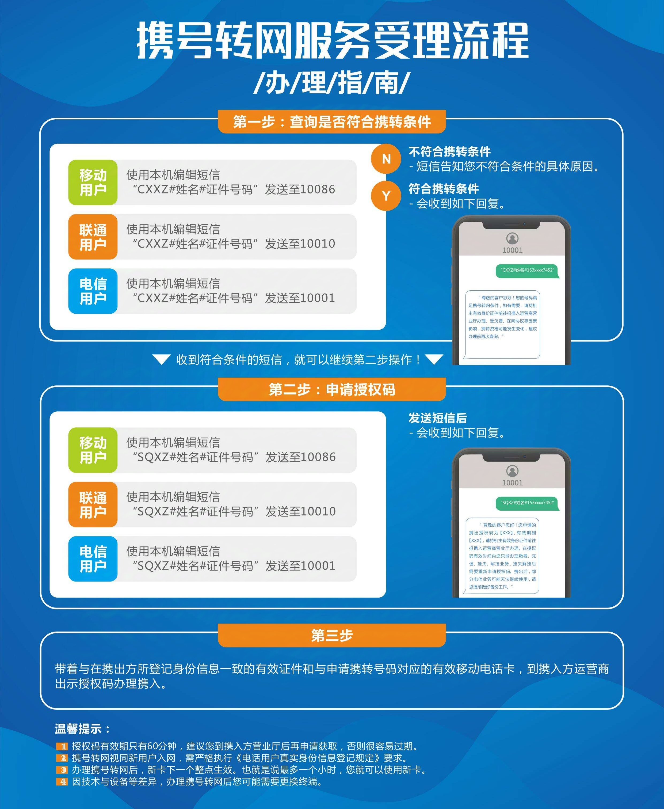

# 运营商发展简史

1. **中国联通（1994年成立）**
   - 成立初衷：最早成立，旨在打破邮电部的独家垄断，引入市场竞争。
   - 大众认知：由于其早期市场份额不如后来者，常被误认为不是最老的，但实际上它是中国第一家大型综合电信运营商。

2. **原中国邮电部**
   - 第一次分拆（1998年）：分拆为中国邮政（负责邮政业务）和中国电信（负责电信业务）。

3. **中国电信的第一次分拆（1999-2000年）**
   - 从原中国电信中剥离移动通信业务，成立了中国移动。
   - 剩余部分继续沿用"中国电信"品牌，专注于固网和宽带业务。

4. **各家特点与市场地位**
   - **中国电信**：继承了邮电部的固网基础设施，因此在宽带领域一直保持着传统优势，实力最强。
   - **中国移动**：专注于移动通信（手机号码业务），抓住了手机普及的爆炸性增长机遇，用户规模迅速扩大，在很短时间内超越了联通和电信，成为市场份额最大的运营商。
   - **中国联通**：作为最初的竞争者，在移动和固网市场均参与竞争，它拥有全业务资质，但在2G时代其GSM网络和CDMA网络并行发展，资源分散，在竞争中处于相对弱势。

5. **新进入者：中国广电（2022年）**
   - 在2022年才正式启动5G网络服务，成为第四大基础电信运营商。
   - 作为新运营商加入市场竞争，目前主要以推出流量卡套餐为主，试图在电信市场分得一杯羹。
