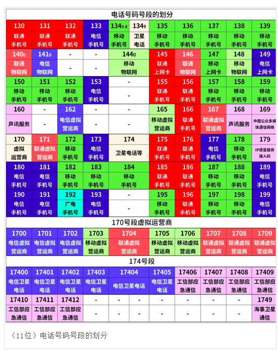
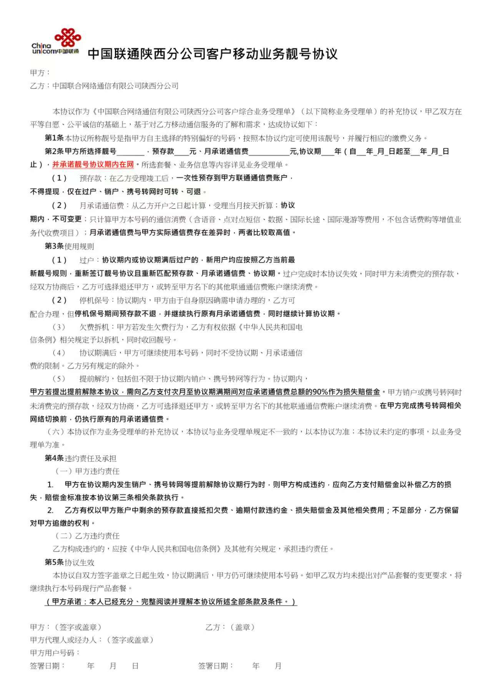

# 手机号

## 中国手机号办理规则与说明

本文档旨在清晰说明在中国境内办理与使用手机号码的相关规则、限制及注意事项。

---

### 1. 运营商分类

中国的电信运营商主要分为以下两类：

#### 1.1 四大国有运营商（基础电信企业）

- 中国移动
- 中国联通
- 中国电信
- 中国广电

#### 1.2 全国虚拟运营商

- 数量众多，例如阿里通信、小米移动、京东通信等。
- **参考名单**：[知乎专栏文章](https://zhuanlan.zhihu.com/p/413595342)

---

### 2. 号码办理数量限制（"一证五卡"与"一证十号"）

根据国家工业和信息化部（工信部）的规定，个人用户办理手机号受到以下严格限制：

| 用户类型 | 限制规则 | 说明 |
| :--- | :--- | :--- |
| **普通用户** | 同一运营商上限：5个号 | 在同一家基础运营商（移动、联通、电信、广电）旗下，个人最多可办理 5个 手机号。 |
| | 所有运营商合计上限：10个号 | 在所有四家基础运营商旗下，个人名下合计最多可办理 10个 手机号。 |
| **失信用户** | 每家仅可保留1张卡 | 被运营商列为"失信用户"（通常因欠费停机等）的，在5年惩戒期内，在每家基础运营商仅可保留 1张 电话卡。 |

---

### 3. 重要说明与历史问题

#### 3.1 关于虚拟运营商（虚商）

- **历史问题**：在2024年以前，虚拟运营商在号码数量和实名制要求上管理相对宽松。这导致部分用户（尤其是曾丢失过身份证的）在不知情的情况下，名下被办理了大量虚商电话卡。
- **现状**：近年来，国家监管已极大加强。目前所有虚拟运营商均需严格落实实名制登记，但其办理的号码不占用上述"10张"基础运营商的名额。

#### 3.2 其他政策细节

- **注销冷却期**：手机号码注销后，通常需要间隔 1个月（即1年加1个月冷却期）才能重新办理新卡。
- **年龄限制**：未满 18周岁 的用户无法独立开办手机卡。

---

### 4. 自查名下号码方法

如果您担心名下是否有未知的手机号，可以使用官方提供的 **"一证通查"** 服务进行免费查询。

- **查询途径**：
   - **微信**：搜索"工信微报"或"一证通查"官方公众号/小程序。
   - **支付宝**：在首页搜索框搜索"一证通查"服务。
- **覆盖范围**：查询结果将列出您名下在所有基础运营商和虚拟运营商处注册的手机号码。

> **提示**：若发现非本人使用或不需要的号码，请务必尽快联系相应运营商进行注销，以免影响您办理新业务或产生潜在风险。

---

## 手机号码运营商识别与靓号业务规范

### 一、 手机号码结构与运营商识别

#### 1. 号段与运营商（看前三位）

通过手机号码的前三位数字，可以快速判断其所属的运营商。

| 运营商 | 常见号段 |
| :--- | :--- |
| **中国联通** | 130、131、132、155、156、166、175、176、185、186 |
| **中国电信** | 133、153、173、177、180、181、189、190、191、193、199 |
| **中国广电** | 192 |

#### 2. 中间四位：归属地

这四位数字代表了号码的初始归属地区。

#### 3. 末尾四位：个人编码

这是随机分配的数字，用于区分不同用户。

#### 4. 应用场景

在市场上，通过观察店铺联系方式或车辆挪车电话，可以快速判断用户所属运营商。在服务客户时，可以主动询问号码前三位，帮助那些不清楚自己运营商的客户进行识别。此方法同样适用于已携号转网的客户，能第一时间做出初步判断。

---

### 二、 西安靓号（特殊号码）业务规范

#### 1. 靓号类型

靓号，规范名称为"特号"，主要包括以下几类：

- **生日号**：与生日日期匹配的号码。
- **连续号**：数字连续递增或递减的号码。
- **豹子号**：后几位数字相同的号码（如666、8888）。
- **四连号**：后四位数字相同的号码。
- **重复号**：包括单重复号、双重复号等有规律的号码。
- **区号号**：包含城市区号的号码。

#### 2. 推广策略与风险提示

- **不作为主推**：公司仅在节假日等特定时点不定期投放，资源有限，不建议作为主要突破点主动推荐。
- **资源不确定性**：号码资源紧缺，难以保证能完全投合用户喜好。

#### 3. 重要用户协议与约束条款

靓号业务附有严格的协议，务必向用户清晰说明：

- **最低消费与在网时长**：
   - 用户需承诺 **每月最低消费**。
   - 需承诺 **长期在网（通常10年起）**。
- **违约后果**：
   - 如果用户提前解约（包括销户和协议期内携号转网），需要支付高额违约金。
   - 违约金计算方式通常为：剩余合约期累计最低消费总额的 90%。（请注意：此比例常见，但并非绝对，具体以签署的协议为准，可能存在30%等其他比例）。
   - 此操作后期处理隐患大，务必谨慎。

> 针对电信用户遇到的虚假靓号协议问题，以下两种情况需特别留意：
> 
> 1. 无明显规律的号码：部分电信号码本身并无特殊规律，但合约中却包含靓号协议。
> 2. 2019年之前入网的号码：即使号码看起来符合靓号特征，也可能存在类似情况。
> 
> 用户可通过电信官方APP的"一键诊断"功能进行复查。若诊断结果中未显示相关协议，则可认定该靓号协议为虚假协议，不具备实际效力。

#### 4. 靓号过户及转网规则

1. 协议期内或协议期满后过户：新的持有者需按当前最新的靓号协议，重新履行最低消费和协议期限。
2. 协议期后携号转网：靓号协议期满后办理携号转网，首次转出时可不执行靓号协议。但若后续再办理过户，将重新触发靓号协议。

#### 5. 增值业务收费标准

- 靓号低消只算手机卡套餐部分，不计算增值业务及宽带收费相关项目。
- 套餐外的通话费用或流量费用正常算入靓号低消，但如果是摄像头 7 天回看、宽带提速、云盘会员等额外业务均属于增值业务，费用会单独计费。

#### 6. 操作流程提醒

- 在选号时，用户可通过输入完整号码搜索，系统会明确展示该靓号的月最低消费和年限要求。
- 在签名确认前，务必引导用户**预览并讲清《靓号协议》** 的所有规则，确保用户完全理解并同意。
特别注意：协议期内的靓号办理过户，新用户通常需要重新签订靓号协议并遵守新的消费标准。则，确保用户完全理解并同意。
- **特别注意**：协议期内的靓号办理**过户**，新用户通常需要**重新签订**靓号协议并遵守新的消费标准。
  

