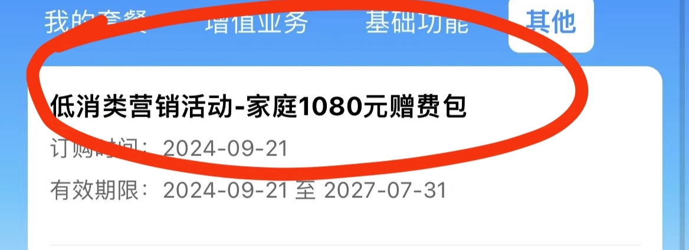
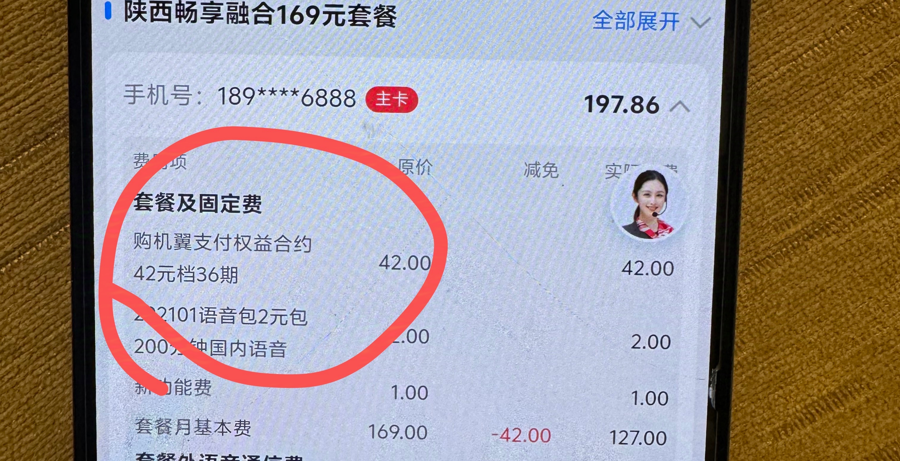
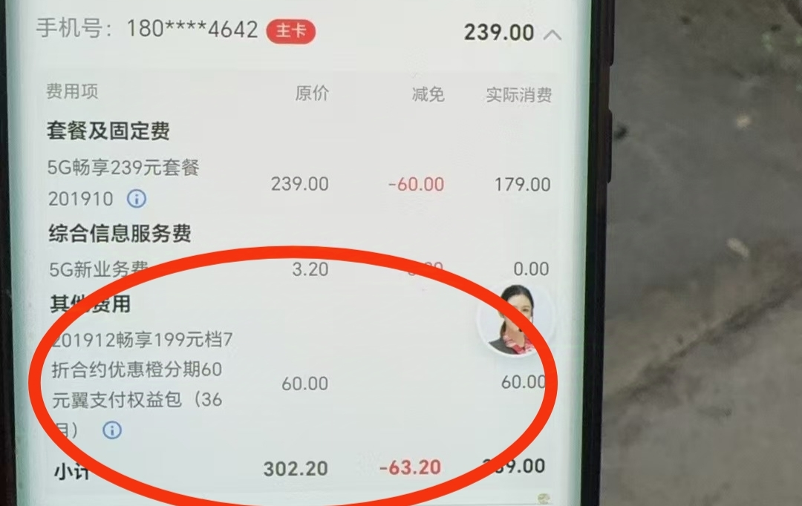
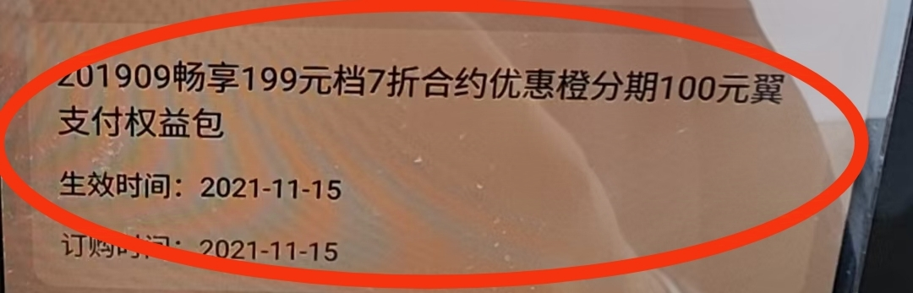

# 客户信息查询

> 了解用户的真实消费、实际使用情况，挖掘隐形需求，为后续服务或营销做准备

---

## 目录

1. [核心目标](#核心目标)
2. [中国移动查询](#一中国移动查询)
3. [中国电信查询](#二中国电信查询)
4. [中国联通查询](#三中国联通查询)
5. [三大运营商对比](#四三大运营商对比)
6. [通用快捷查询方式](#五通用快捷查询方式)

---

## 核心目标

了解用户的**真实消费**、**实际使用情况**，挖掘**隐形需求**，为后续服务或营销做准备。

---

## 一、中国移动查询

### 1.1 查询项目及路径

| 查询项目 | 目的/应用场景 | 具体操作路径 |
|----------|--------------|-------------|
| **账单查询** | 了解历史消费构成、月均消费、是否有合账付费等 | **中国移动APP** → 首页 → **查账单** → 可查询前几个月的历史账单 |
| **号码归属地** | 确认用户所在地，用于推荐本地化活动或服务 | - 通过用户安卓手机的拨号功能自动识别 - 互联网搜索（如百度查询） |
| **流量/通话使用量** | 分析用户使用习惯，判断当前套餐是否匹配 | - **中国移动APP** → **余量查询** - 拨打运营商客服热线 **10086** 查询 |
| **宽带地址** | 确认宽带安装地址，用于办理迁移、续约或推荐提速等业务 | - **中国移动APP** → 首页 → 服务大厅 → 宽带服务 → 宽带专区查询 - **中国移动APP** → 文字客服 → 输入"查询宽带办理时间"等关键词触发查询 |
| **合约信息** | 确认用户是否有在约合约，避免营销冲突，寻找合约到期契机 | **中国移动APP** → 我的 → **已订业务** → **其他** 中查看 |

### 1.2 常见重要合约类型

| 合约类型 | 说明 |
|----------|------|
| **5G金币合约** | 参与5G金币活动，承诺在网时长 |
| **1080元金币消费券合约** | 大额消费券合约，通常有较长的在网期限 |
| **裸机终端购机合约** | 购买裸机时的优惠合约 |
| **FTTR（全光Wi-Fi）合约** | 全屋Wi-Fi组网服务合约 |

---

## 二、中国电信查询

### 2.1 查询项目及路径

| 查询项目 | 具体查询路径 |
|----------|-------------|
| **账单查询** | 1. **中国电信APP**：首页 → 话费账单 2. **陕西电信小程序**：首页 → 话费账单 3. 拨打客服电话 **10000** 查询 |
| **号码归属地** | 1. **中国电信APP**：底部"我" → 个人信息 2. **手机自带拨号功能**：部分安卓手机在拨号盘输入号码时会显示 3. **互联网搜索**：直接在搜索引擎搜索该号码 |
| **流量/通话使用量** | 1. **中国电信APP**：首页右划 → 流量查询 2. **陕西电信小程序**：话费账单 → 使用量信息 → 历史用量查询 3. 拨打客服电话 **10000** 查询 |
| **宽带地址** | **中国电信APP**：首页 → 宽带（相关服务入口） |
| **合约信息** | **中国电信APP**：话费账单 → 已订业务 / 我的优惠 |

### 2.2 常见重要合约类型

在查询"合约信息"时，请特别留意以下常见的、有长期约束性的合约类型：

| 合约类型 | 说明 |
|----------|------|
| **橙分期** | 与金融信贷相关的分期合约 |
| **翼支付** | 可能与优惠活动绑定的支付合约 |
| **FTTR** | 全屋Wi-Fi组网服务合约 |
| **一体化礼包** | 通常包含手机、宽带、话费等的综合合约 |

> 💡 **温馨提示**：以上路径为通用指引，不同省份的电信APP或小程序界面可能略有差异。如果找不到相应入口，最直接的方式是**拨打客服电话10000**进行咨询。

---

## 三、中国联通查询

### 3.1 查询项目及路径

| 查询项目 | 具体查询路径 |
|----------|-------------|
| **账单查询** | 1. **中国联通APP**：首页 → 话费账单 / 查询 → 账单查询 2. 拨打客服电话 **10010** 查询 |
| **号码归属地** | 1. **中国联通APP**：我的 → 个人信息 2. **手机自带拨号功能**：部分安卓手机在拨号盘输入号码时会显示 3. **互联网搜索**：直接在搜索引擎搜索该号码 |
| **流量/通话使用量** | 1. **中国联通APP**：首页 → 余量查询 2. 拨打客服电话 **10010** 查询 3. 发送短信 **CXLL** 或 **1071** 至 **10010** |
| **宽带地址** | **中国联通APP**：服务 → 宽带 → 宽带信息查询 |
| **合约信息** | **中国联通APP**：我的 → 我的套餐 / 已订业务 |

### 3.2 常见重要合约类型

| 合约类型 | 说明 |
|----------|------|
| **存费送费合约** | 预存话费送话费的合约活动 |
| **终端合约** | 购机优惠合约，承诺在网时长 |
| **宽带融合合约** | 手机+宽带的融合套餐合约 |
| **FTTR合约** | 全屋Wi-Fi组网服务合约 |

> 💡 **温馨提示**：联通APP界面因版本更新可能有所变化，如找不到对应入口，建议**拨打客服电话10010**或使用APP内的智能客服查询。

---

## 四、三大运营商对比

### 4.1 客服热线对比

| 运营商 | 客服热线 | 自助查询短信发送号码 |
|--------|----------|---------------------|
| **中国移动** | 10086 | 10086 |
| **中国联通** | 10010 | 10010 |
| **中国电信** | 10000 | 10001 |

### 4.2 查询路径对比

| 查询项目 | 中国移动 | 中国联通 | 中国电信 |
|----------|----------|----------|----------|
| **账单查询** | APP首页 → 查账单 | APP首页 → 话费账单 | APP首页 → 话费账单 |
| **余量查询** | APP → 余量查询 | APP首页 → 余量查询 | APP首页右划 → 流量查询 |
| **合约查询** | 我的 → 已订业务 → 其他 | 我的 → 我的套餐/已订业务 | 话费账单 → 已订业务/我的优惠 |
| **宽带查询** | 服务大厅 → 宽带服务 | 服务 → 宽带 → 宽带信息 | 首页 → 宽带 |

---

## 五、通用快捷查询方式

### 5.1 短信查询（通用）

| 运营商 | 查询余额 | 查询流量 | 查询话费 |
|--------|----------|----------|----------|
| **中国移动** | 发送 **YE** 至 10086 | 发送 **CXLL** 或 **103** 至 10086 | 发送 **HF** 或 **101** 至 10086 |
| **中国联通** | 发送 **YE** 至 10010 | 发送 **CXLL** 或 **1071** 至 10010 | 发送 **HF** 或 **101** 至 10010 |
| **中国电信** | 发送 **102** 至 10001 | 发送 **108** 或 **421** 至 10001 | 发送 **101** 至 10001 |

### 5.2 快捷查询总结

| 方式 | 优点 | 缺点 |
|------|------|------|
| **官方APP** | 信息最全面，可办理业务 | 需要下载安装，需登录 |
| **客服电话** | 人工服务，可解决复杂问题 | 可能需要排队等待 |
| **短信查询** | 简单快捷，无需网络 | 信息较简单，只能查基础数据 |
| **微信小程序** | 无需下载APP，即用即走 | 功能可能不如APP全面 |

---

*文档整理时间：2026年5月12日*

**优化说明**：
- 增加了目录导航
- 补充了中国联通的查询路径（原文档缺失）
- 增加了三大运营商查询方式对比表
- 增加了通用快捷查询方式（短信指令）
- 保留了所有原始图片
