# 联通公众与操作流程

## 联通公众

下载链接：https://msgo.10010.com/ltgzapp/index.html

苹果手机下载第三方 app 需要进行信任应用：手机设置-通用-VPN与设备管理-企业级APP-找到联通公众点"信任"。

### 工号

注册流程视频：

compose_video_1732328523321.mp4

[https://www.alipan.com/s/Uvy5mhPkNi1](https://www.alipan.com/s/Uvy5mhPkNi1)

点击链接保存，或者复制本段内容，打开「阿里云盘」APP，无需下载极速在线查看，视频原画倍速播放。

### 常用功能

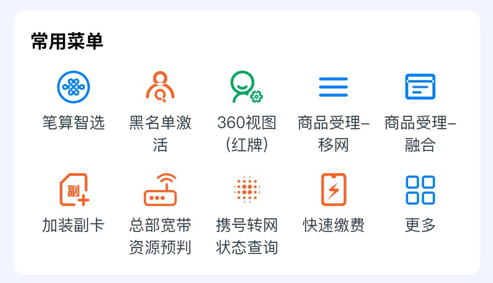

- **笔算智选**：查询号码的基本情况；如近三个月的实际消费、主副卡、有没有宽带等。
- **特殊用户激活**：查询该用户是否为陕西黑名单用户。
- **360视图（红牌）**：查询该用户是否为红黄牌用户。
- **商品受理-移网**：受理单卡套餐（无宽带）。
- **商品受理-融合**：受理融合套餐（有宽带）。
- **加装副卡**：新开副卡或携转为副卡。
- **总部宽带资源预判**：查询宽带资源。
- **携号转网状态查询**：查询转网状态，转入或者转出均能查询到。
- **快速缴费**：充话费，只能给本地号码充值。

## 操作流程

[开卡流程.pdf](开卡流程.pdf)

## 流程中的常见问题

### 信息认证

#### 身份证无法读取

尝试家人身份证。

#### 黑名单

区分用户是本地黑名单还是外地黑名单。

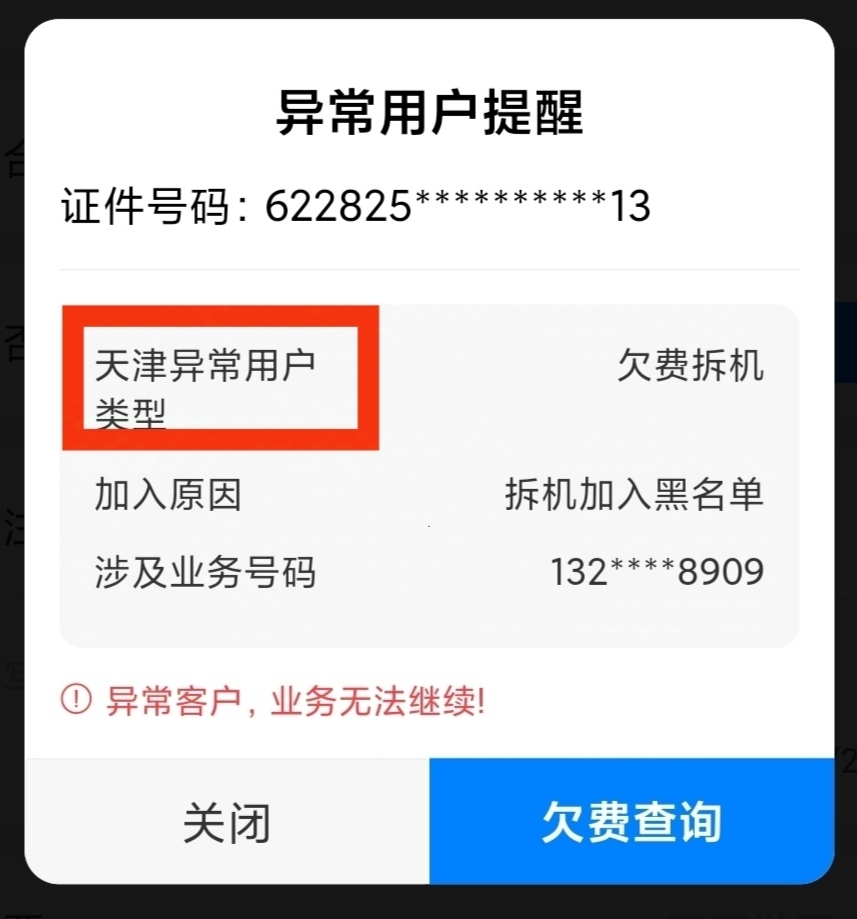

可利用**商品受理-融合-施工中开户**查询到黑名单具体号码。

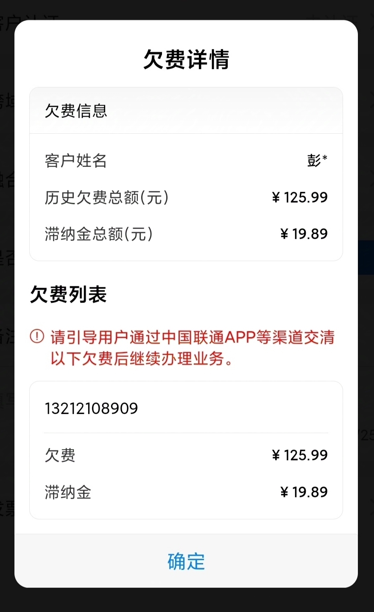

再利用手机拨号功能（苹果手机不行）或者浏览器搜索可查询到具体归属地。

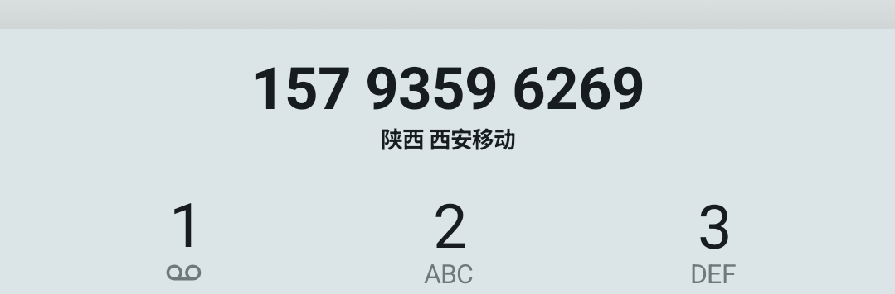

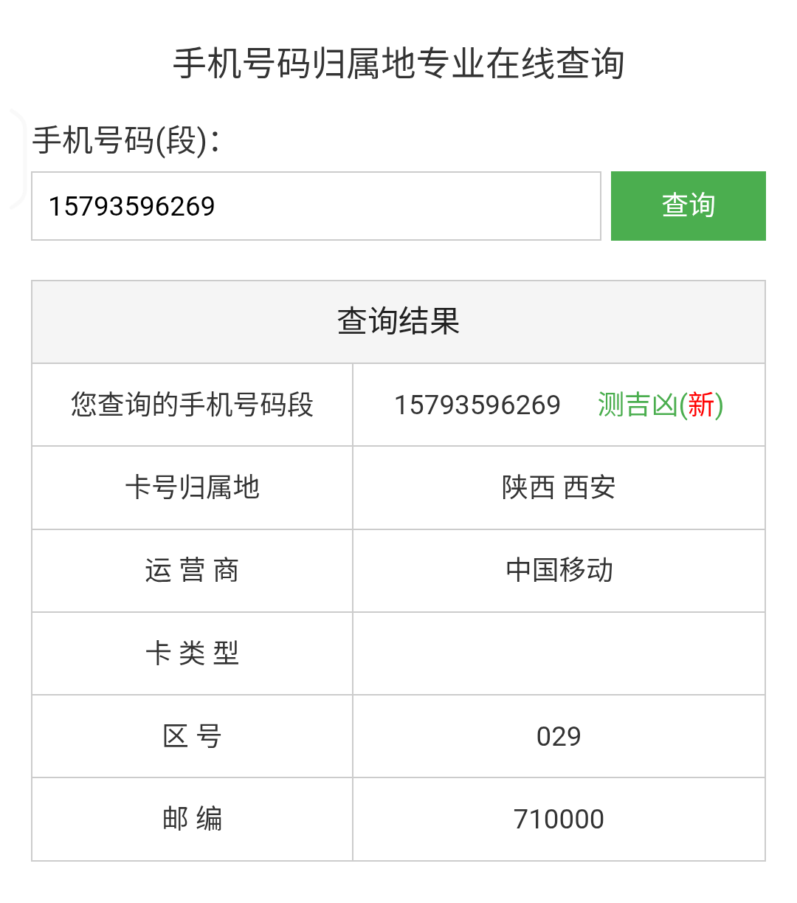

- **本地黑名单**：金额小于100或者时间大于5年的，可直接解除。
- **外地黑名单**：如果对应归属地有分公司可联系TC售后客服帮忙解除；例如重庆、杭州等。
- **黑名单通解**：打10010客服申诉，部分黑名单可以利用联通APP销户及停机号码交费0.01元消除。
- **特殊黑名单**：信安黑名单（涉诈用户，此类用户需找公安局开具证明，基本无法办理）。

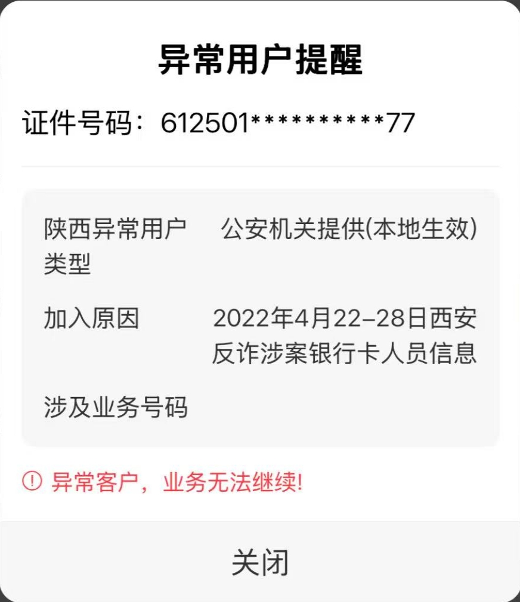

#### 红黄牌

##### 红牌产生原因

- **短时间内频繁开户销户**：30天内累计销户≥2次。

- **名下存在异常号码**：名下已有 1 个及以上号码（不区分主副卡）处于局方停机、局方半停机状态。

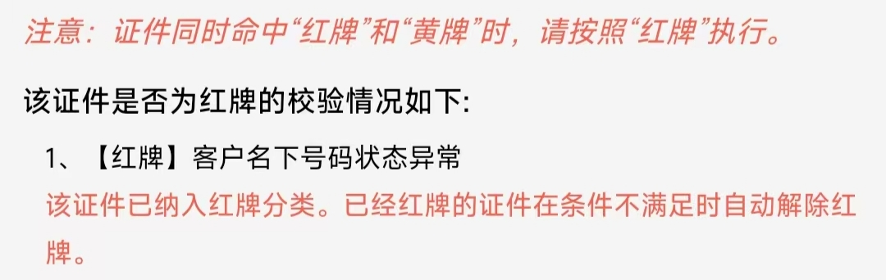

##### 黄牌产生原因

- **名下存在异常号码**：名下已有1个号码处于局方停机、局方办停机状态。

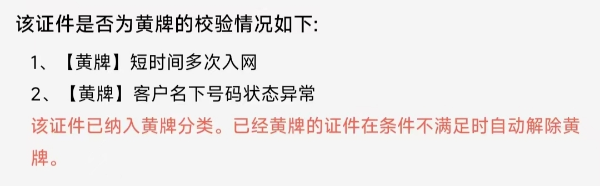

- **低高龄用户**

> **红牌、异常号码均无法办理新入网**，**低高龄用户不影响入网**。
> 
> **红黄牌不影响携转**。

#### 身份信息不一致

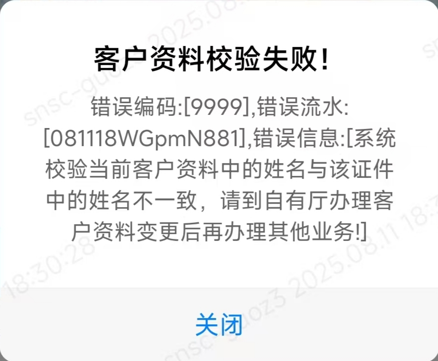

**该用户改过名，需到营业厅更新实名信息**。

#### 一证多户

##### 一证五户

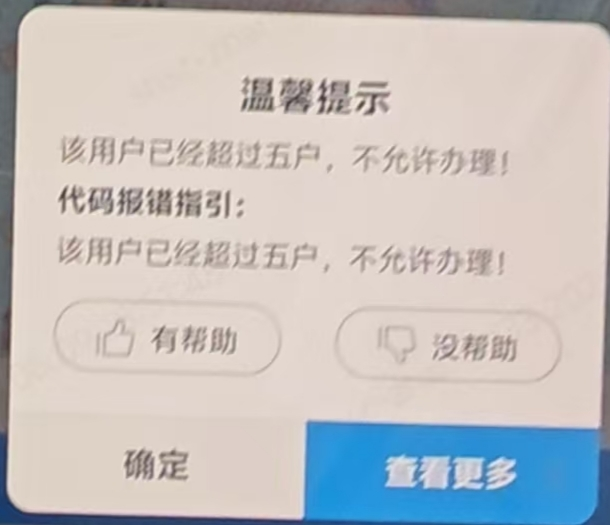

名下已有五个联通号码，需要销户。

##### 一证十户

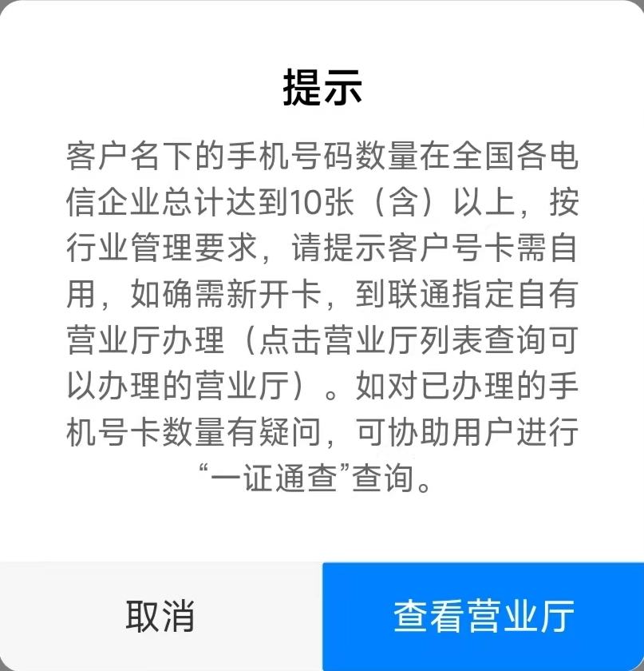

这种情况大部分是名下存在多个虚拟运营商的号码，需要销户。

微信或者支付宝搜索**一证通查**可查询名下的号码数量及运营商（填写的姓名、身份证号、手机号都必须是本人的）。

#### 人脸识别不通过

换背景换角度多尝试。

### 携转过程

#### 手机号输错

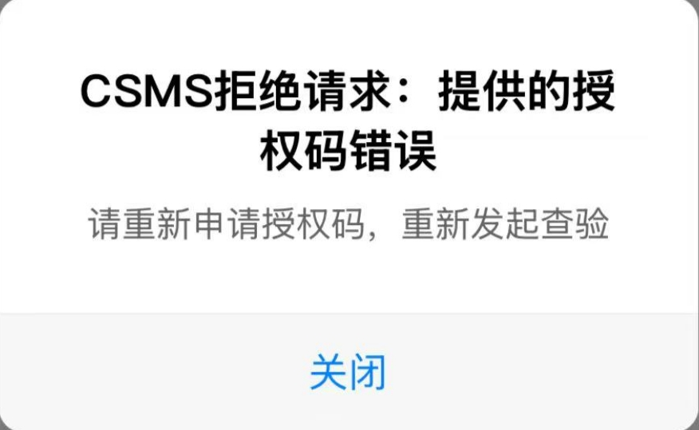

#### 号码非本人

#### 携转码输错

携转码输错**系统不会第一时间反馈出来**，但是在给客户重新做携转时会弹出在途单。

**携转过程出现的问题有时候系统不会第一时间反馈出来，需要在走完携转流程后第一时间使用携号转网状态查询功能复查！**

正确状态

错误状态

如果流程已经走完了但是携转失败，此时白卡已经写入了数据，可以让后台操作更正携转码或者用户信息，**白卡即可生效使用，无需重新写卡**；如果无法更正，则需要撤单重新走流程，重新写卡。

### 录宽带过程

#### 忘记备注

宽带师傅会打电话给你要求撤单重录。

#### 使用总部地图选址导致宽带账号申请失败

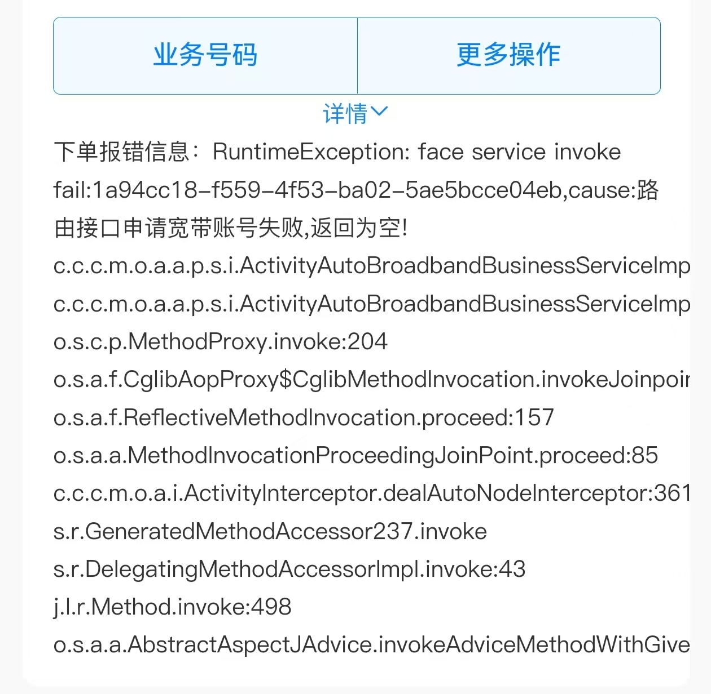

可先用**总部地图选址**找到具体的装机地址，再切回**标准地址**下单。

Screenrecorder-2024-12-25-18-43-29-567.mp4

https://www.alipan.com/s/fr7TBKRQQQZ

点击链接保存，或者复制本段内容，打开「阿里云盘」APP，无需下载极速在线查看，视频原画倍速播放。
