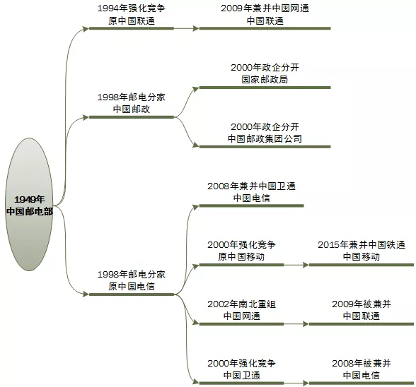

# 中国电信行业发展历程

> 从垄断到竞争：七十三年行业变革之路。

## 目录

<a class="tc-blue" href="#1949年邮电部成立--垄断时代开启" style="text-decoration:none">

📅 1949年

邮电部成立 —— 垄断时代开启

</a>

<a class="tc-green" href="#1994年中国联通成立--打破垄断" style="text-decoration:none">

🌱 1994年

中国联通成立 —— 打破垄断

</a>

<a class="tc-red" href="#1998年邮电部分拆--政企分离" style="text-decoration:none">

🔄 1998年

邮电部分拆 —— 政企分离

</a>

<a class="tc-blue" href="#1999-2000年中国电信第一次分拆--移动固网分离" style="text-decoration:none">

⚡ 1999-2000年

中国电信第一次分拆 —— 移动固网分离

</a>

<a href="#2000年后三足鼎立格局形成" style="text-decoration:none tc-orange">

⚔️ 2000年后

三足鼎立格局形成

</a>

<a class="tc-blue" href="#2022年中国广电入局--第四大运营商诞生" style="text-decoration:none">

🎯 2022年

中国广电入局 —— 第四大运营商诞生

</a>

## 1949年：邮电部成立 —— 垄断时代开启

### 📅 时间节点
<strong>1949年11月1日</strong>

### 🏛️ 机构设立
<strong>中央人民政府邮电部</strong>正式设立。

### 📋 核心职能
- 统一管理全国的<strong>邮政</strong>事业。
- 统一管理全国的<strong>电信</strong>事业。

### ⚡ 行业特征

🏢 经营模式

政企合一

👑 市场地位

垄断经营者

🚫 竞争格局

独家垄断

## 1994年：中国联通成立 —— 打破垄断

### 📅 时间节点
<strong>1994年</strong>

### 🎯 成立背景
为打破<strong>邮电部的独家垄断</strong>，引入<strong>市场竞争</strong>。

### 🏢 机构设立
国务院批准成立<strong>中国联通</strong>。

### 🏆 历史意义
- <strong>中国第一家大型综合电信运营商</strong>。
- 标志着中国电信行业从<strong>垄断走向竞争</strong>。
- 开启了<strong>市场化改革</strong>的序幕。

## 1998年：邮电部分拆 —— 政企分离

### 📅 时间节点
<strong>1998年</strong>

### 🔧 改革动作
原<strong>邮电部被撤销</strong>，职能进行<strong>分拆重组</strong>。

### 📊 分拆结果

📮 邮政业务

新组建：国家邮政局

后续演变 → 中国邮政集团

📡 电信业务

新组建：中国电信公司

由信息产业部管理

### ⚡ 改革意义
- 实现<strong>政企分离</strong>。
- 推动<strong>专业化发展</strong>。
- 为后续<strong>电信改革</strong>奠定基础。

## 1999-2000年：中国电信第一次分拆 —— 移动固网分离

### 📅 时间节点
<strong>1999年 - 2000年</strong>

### 🔧 改革动作
从"<strong>中国电信</strong>"中<strong>剥离移动通信业务</strong>。

### 📊 分拆结果

📱 中国移动

业务聚焦

移动通信市场

新成立品牌。

🏠 中国电信

业务聚焦

固网业务

沿用原有品牌。

### ⚡ 战略意义
- <strong>移动与固网分离</strong>，专业化运营。
- 为移动通信的<strong>爆发式增长</strong>创造条件。
- 形成<strong>固网+移动</strong>双轨发展格局。

## 2000年后：三足鼎立格局形成

### 📅 时间跨度
<strong>2000年至今</strong>

### 🏢 三大运营商

1️⃣ 中国电信

💪 核心优势

固网和宽带领域

🎯 市场定位

传统强者，固网基础深厚。

2️⃣ 中国移动

💪 核心优势

移动通信爆发增长

🎯 市场定位

用户规模最大的运营商。

3️⃣ 中国联通

💪 核心优势

全业务运营

🎯 市场定位

综合运营商，持续调整发展策略。

### 📈 竞争格局

📊 中国电信市场格局

中国电信

固网/宽带

中国移动

移动通信

中国联通

全业务

## 2022年：中国广电入局 —— 第四大运营商诞生

### 📅 时间节点
<strong>2022年</strong>

### 🏢 新进入者
<strong>中国广电</strong>（中国广播电视网络有限公司）

### 🏆 行业地位
正式成为<strong>第四大基础电信运营商</strong>。

### ⚡ 市场影响

🔄 打破格局

打破三大运营商格局

📶 5G时代

引入5G时代的新竞争者

🚀 市场化

推动行业进一步市场化和多元化

## 总结：从垄断到竞争的演变历程

1949-1994

🏛️ 垄断期

邮电部独家经营

一家垄断

1994-1998

🌱 破冰期

中国联通成立，打破垄断

双寡头竞争

1998-2000

🔄 改革期

邮电部分拆、移动固网分离

政企分离

2000-2022

⚔️ 竞争期

移动、联通、电信三足鼎立

三足鼎立

2022至今

🎯 多元期

中国广电入局，四大运营商竞争

四强争霸

*文档生成时间：2026年5月11日*
