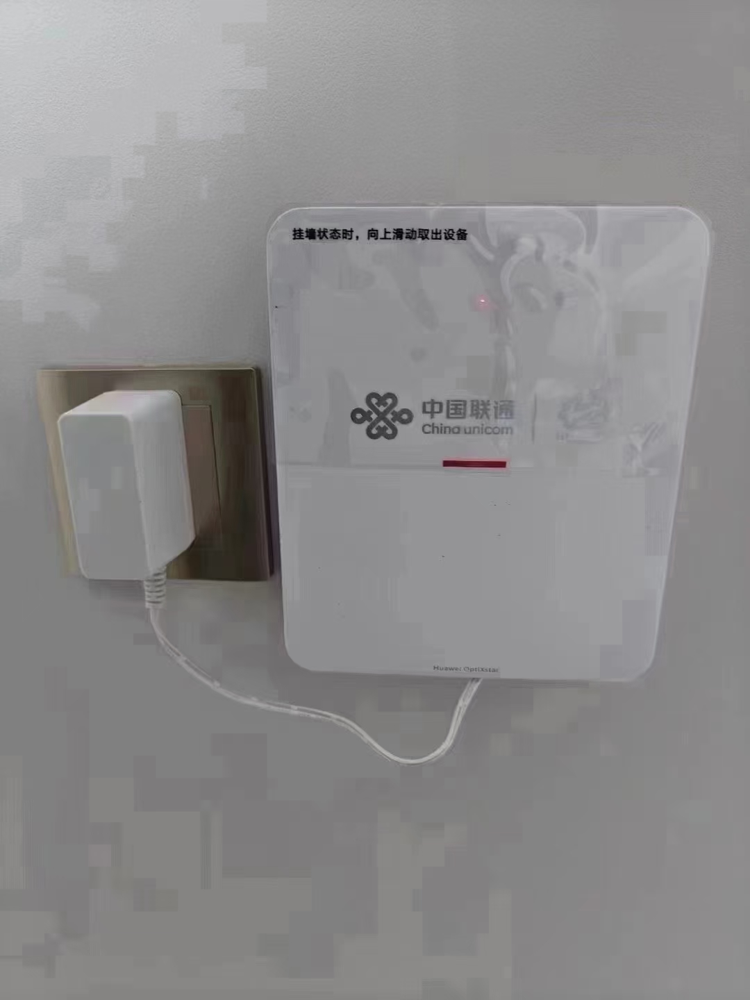
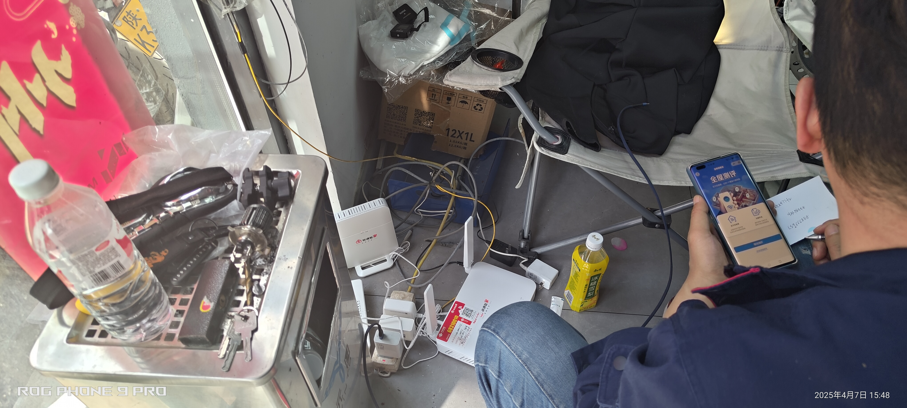
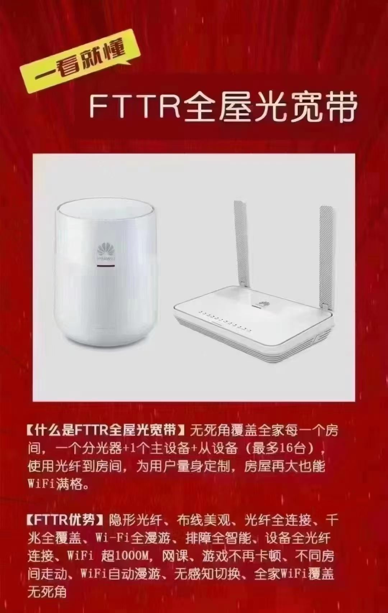
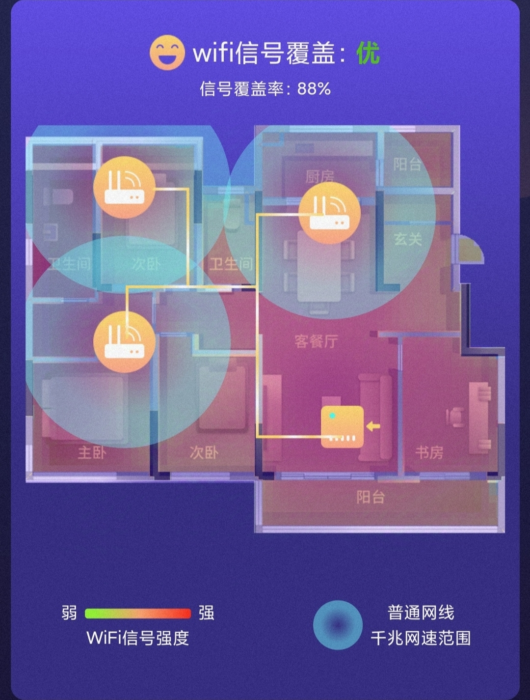
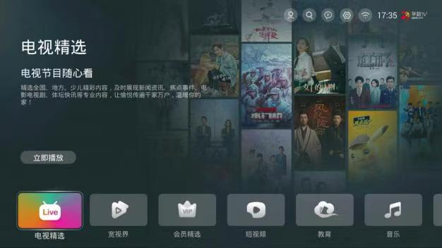
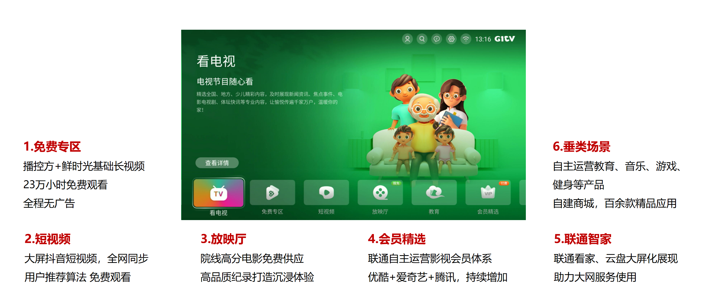
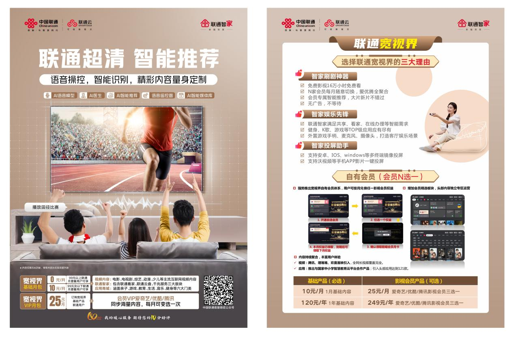

# 通信套餐核心组成解析

> 一套完整的通信套餐通常由**通话服务**、**流量服务**和**宽带服务**三大部分构成

---

## 目录

1. [通话服务](#一通话服务)
2. [流量服务](#二流量服务)
3. [宽带与固网服务](#三宽带与固网服务)
4. [网速知识详解](#四网速知识详解)
5. [宽视界产品介绍](#五宽视界产品介绍)

---

## 一、通话服务

指套餐内包含的语音通话时长，主要分为以下几类：

| 类型 | 说明 | 特点与运营商差异 |
|------|------|------------------|
| **亲情互打** | 与指定的号码之间通话免费 | **移动**：主副卡、全国亲情网、家庭V网（短号） **联通**：主副卡、全国亲情网、短号 **电信**：主副卡、全国亲情网 |
| **省内/市内通话** | 仅在号码归属的省或市内使用 | 在省外/市外使用时，将按套餐外资费收费（多见于老套餐） |
| **国内通话** | 在中国大陆范围内（不含港澳台）通用 | **当前主流套餐的标准配置** |
| **国际漫游** | 在境外其他国家或地区通话 | 资费因目的地国家/地区而异，需单独确认 |

> **套餐外标准资费参考**：通常为 **0.15元/分钟**，少数为 0.1元、0.19元 或 0.36元/分钟

---

## 二、流量服务

指套餐内包含的移动数据上网流量，主要分为以下几类：

| 类型 | 说明 | 使用范围与特点 |
|------|------|----------------|
| **定向流量** | 仅限指定的手机App（如抖音、微信、淘宝）使用 | 使用非指定App或App内的广告、跳转链接等，可能会消耗通用流量 |
| **区域流量** | 仅在特定区域（如省内、校园内）使用 | 离开指定区域后，该部分流量失效，上网将消耗国内通用流量 |
| **国内流量** | 在中国大陆范围内（不含港澳台）通用 | **主流套餐的核心组成部分**，部分套餐的此部分流量可结转到次月使用 |
| **国际漫游** | 在境外其他国家或地区上网 | 资费因目的地国家/地区而异，建议出行前办理专属流量包 |

<b>💡 流量用量参考</b>

- **单位换算**：1 GB = 1024 MB，1 MB = 1024 KB（技术标准）；运营商计费通常按 **1 GB = 1000 MB** 计算
- **1 GB流量大约可用于**（实际消耗因应用、画质设置和个人使用习惯而异）：
  - 观看约 **半小时** 的抖音短视频（超清画质）
  - 玩约 **10小时** 的《王者荣耀》等手机游戏
  - 进行约 **1小时** 的微信视频通话

---

## 三、宽带与固网服务

### 3.1 宽带接入方式

| 类型 | 说明 | 特点与性能 |
|------|------|-----------|
| **光纤入户 (FTTH)** | 光纤直接到用户家中，是当前主流技术 | **优点**：信号损耗小、传输速度快、稳定性极高 **所需设备**：需要光猫和路由器 |
| **非光纤入户 (旧技术)** | 包括ADSL（电话线）和FTTB（光纤到楼+网线入户）等 | **缺点**：信号损耗较大、传输速度慢、稳定性相对较差 **现状**：正逐渐被光纤入户取代 |

### 3.2 路由器与组网

#### 普通 WiFi

- 用户需**自备路由器**（部分老式光猫自带路由功能，需提前确认）
- 运营商也可提供路由器**租赁服务**，通常涉及月租和一次性调试费

#### FTTR（全屋 WiFi）

| 项目 | 说明 |
|------|------|
| **组成** | 由一个**主光猫**和多个**从光猫**组成，设备已集成路由功能，无需额外购买路由器 |
| **优势** | 实现全屋千兆无缝覆盖，网络信号强、质量稳定，支持无缝切换 |
| **适用场景** | 大户型、别墅或对网络质量要求极高的用户，可根据面积需求配置"**一主多从**" |

---

## 四、网速知识详解

### 4.1 核心概念：网速单位换算

网络速率的基本单位是 **比特/秒 (bit/s, bps)**，而文件大小的单位是 **字节 (Byte)**。

> **核心关系：1 Byte = 8 bits**

| 换算关系 | 说明 |
|----------|------|
| 1 MB/s = 8 Mbps | 下载速度与带宽速率的换算 |
| 1 GB/s = 8 Gbps | 同上，更大单位 |

- **行业惯例**：运营商宣传的宽带速率（如1000M）单位是 **Mbps** 或 **Gbps**，通常按 **1000进制**计算；设备显示的下载速度单位是 **MB/s**
- **简易公式**：`理论最高下载速度 (MB/s) ≈ 宽带套餐速率 (Mbps) ÷ 8`

> 💡 **例如**：1000M宽带 ≈ 1000 ÷ 8 = **125 MB/s** 的下载速度

### 4.2 上行 vs. 下行速度

#### 上行速度（上传速度）

| 项目 | 说明 |
|------|------|
| **功能** | 将本地数据发送到网络 |
| **影响场景** | 网页浏览、视频直播、FPS类网络游戏、视频会议、大文件上传 |
| **体验影响** | 上行速度不足直接导致**游戏高延迟**（Ping值高）、**直播卡顿**、**视频通话质量差** |

#### 下行速度（下载速度）

| 项目 | 说明 |
|------|------|
| **功能** | 从网络接收数据 |
| **影响场景** | 下载文件、观看在线视频、加载网页内容、更新软件 |
| **注意** | 日常使用的APP（如应用商店）会被手机系统**强制限速**，因此很难达到测速软件的极限速度 |

### 4.3 常见宽带理论速度对照表

🚀 1000M 宽带 旗舰级

📥 下载

≈125 MB/s

📤 上传

≈12.5 MB/s

⚡ 500M 宽带 高速级

📥 下载

≈62.5 MB/s

📤 上传

≈6.25 MB/s

💨 300M 宽带 标准级

📥 下载

≈37.5 MB/s

📤 上传

≈3.75 MB/s

### 4.4 特别提醒：西安地区上行速度政策

> ⚠️ **重要提示（西安地区）**
> - 家庭宽带的上行速度通常被**固定为 50 Mbps**（约 6.25 MB/s）
> - 即使办理了 1000M 宽带，上行速度也可能被限制在 50 Mbps
> - 如需增加上行速度，需要向运营商购买"**上行提速包**"
> - 上行提速包参考价格：约 **1 Mbps / 50元 / 月**（具体以当地运营商政策为准）
> - 对上行有极高要求的企业用户，通常选择**拉专线**的方式获得对称高速网络

### 4.5 小结

| 用户类型 | 关注重点 | 建议 |
|----------|----------|------|
| **大多数家庭用户** | 下行速度 | 下行速度足够日常使用 |
| **游戏玩家 / 主播** | 上行速度 | 需特别关注上行速度是否满足需求 |
| **所有用户** | 实际体验 | 实际使用中受多种因素影响，很难达到理论极限速度 |

---

## 五、宽视界产品介绍

### 5.1 产品定义

**宽视界**是由联通自主研发并运营的**家庭互联网泛视频产品**（互联网电视产品）。

| 特性 | 说明 |
|------|------|
| **网络灵活性** | 不受专网限制，支持 WiFi、有线网络、手机热点等多种接入方式 |

### 5.2 内容组成

#### 1. 免费内容

| 类型 | 说明 |
|------|------|
| **📺 长视频** | 聚合银河、鲜时光（西瓜视频）、优酷、腾讯、爱奇艺等平台免费内容，总量 **23万+小时** |
| **🎬 短视频** | 支持"大屏看抖音"，海量优质短视频内容免费观看，**无广告**，每日更新 **3万+条** |

#### 2. 学习与康养

| 类型 | 说明 |
|------|------|
| **📚 学习资源** | 接入国家中小学智慧教育平台，覆盖小学至高中全年级、全学科课程 |
| **🏥 康养服务** | 提供健康养生知识，结合在线医生咨询，支持小病慢病在线问诊及治疗建议 |
| **💪 健身内容** | 丰富的运动跟练视频，助力家庭健身互动，提升免疫力 |

#### 3. VIP 自选会员

| 项目 | 说明 |
|------|------|
| **内容覆盖** | 汇聚爱奇艺、优酷、腾讯、酷狗全量内容 |
| **会员权益** | 用户可按月自主选择兑换以上四家平台会员权益（**4选1**） |
| **费用标准** | **25元/月** |
| **多路支持** | 同一宽带账号最多可办理 **5路**会员服务 |

---

## 附录：套餐常见问题速查

| 问题 | 答案 |
|------|------|
| 套餐外通话多少钱？ | 通常 **0.15元/分钟** |
| 定向流量可以给所有App用吗？ | **不可以**，仅限指定App，广告和跳转消耗通用流量 |
| 1000M宽带实际下载速度是多少？ | 理论约 **125 MB/s** |
| 宽带速率单位是什么？ | 运营商宣传单位为 **Mbps**，下载速度单位为 **MB/s**，换算关系为 **÷8** |
| 西安宽带上行速度是多少？ | 通常固定 **50 Mbps**，提速需额外购买 |
| 宽视界VIP会员多少钱？ | **25元/月**，4家平台4选1 |
| 宽视界最多几路会员？ | 同一宽带账号最多 **5路** |

---

*文档整理时间：2026年5月12日*

**优化说明**：
- 重新梳理了文档层级结构，将"网速知识详解"和"宽视界"提升为独立大章节
- 补充了运营商流量计费按1000进制计算的说明
- 上行提速包价格标注为参考价格，以当地政策为准
- 增加了目录导航和常见问题速查附录
- 保留了所有原始图片引用
