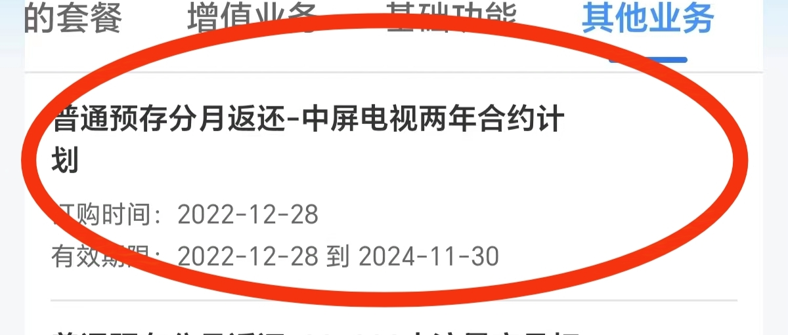
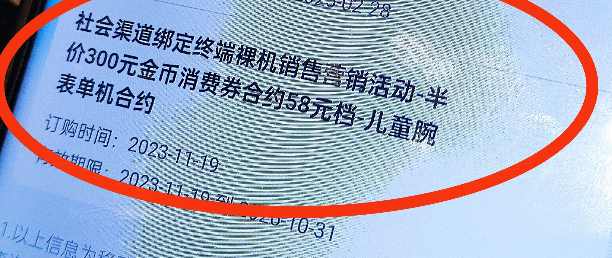
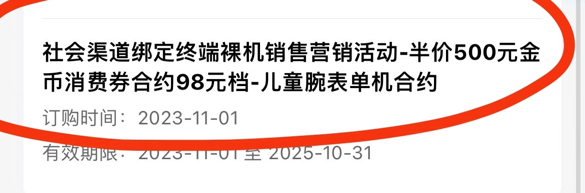
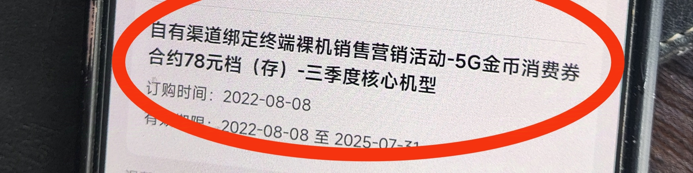
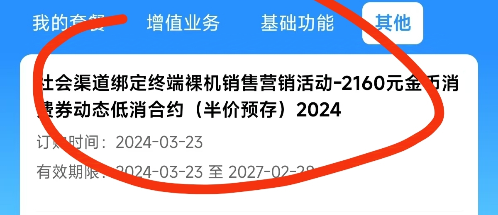
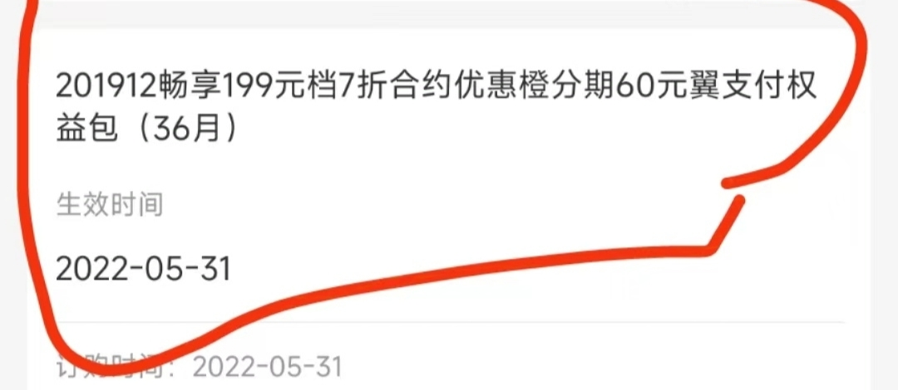

# 客户信息查询

> 了解用户的真实消费、实际使用情况，挖掘隐形需求，为后续服务或营销做准备

📱

中国移动查询

账单 · 流量 · 合约 · 宽带

📞

中国电信查询

账单 · 流量 · 合约 · 宽带

🔵

中国联通查询

账单 · 流量 · 合约 · 宽带

⚡

快捷查询方式

APP · 电话 · 短信 · 小程序

## 核心目标

🎯

了解用户的<strong style="background:rgba(102,126,234,0.1); padding:2px 8px; border-radius:4px; color:#667eea;">真实消费</strong>、<strong style="background:rgba(102,126,234,0.1); padding:2px 8px; border-radius:4px; color:#667eea;">实际使用情况</strong>，挖掘<strong style="background:rgba(102,126,234,0.1); padding:2px 8px; border-radius:4px; color:#667eea;">隐形需求</strong>，为后续服务或营销做准备。

## 一、中国移动查询

### 1.1 查询项目及路径

💰

账单查询

<strong>目的/场景：</strong>了解历史消费构成、月均消费、是否有合账付费等

<strong>操作路径：</strong><strong>中国移动APP</strong> → 首页 → <strong>查账单</strong> → 可查询前几个月的历史账单

📍

号码归属地

<strong>目的/场景：</strong>确认用户所在地，用于推荐本地化活动或服务

<strong>操作路径：</strong> - 通过用户安卓手机的拨号功能自动识别 - 互联网搜索（如百度查询）

📊

流量/通话使用量

<strong>目的/场景：</strong>分析用户使用习惯，判断当前套餐是否匹配

<strong>操作路径：</strong> - <strong>中国移动APP</strong> → <strong>余量查询</strong> - 拨打运营商客服热线 <strong>10086</strong> 查询

🏠

宽带地址

<strong>目的/场景：</strong>确认宽带安装地址，用于办理迁移、续约或推荐提速等业务

<strong>操作路径：</strong> - <strong>中国移动APP</strong> → 首页 → 服务大厅 → 宽带服务 → 宽带专区查询 - <strong>中国移动APP</strong> → 文字客服 → 输入"查询宽带办理时间"等关键词触发查询

📝

合约信息

<strong>目的/场景：</strong>确认用户是否有在约合约，避免营销冲突，寻找合约到期契机

<strong>操作路径：</strong><strong>中国移动APP</strong> → 我的 → <strong>已订业务</strong> → <strong>其他</strong> 中查看

### 1.2 常见重要合约类型

🪙

5G金币合约

参与5G金币活动，承诺在网时长

🎫

1080元金币消费券合约

大额消费券合约，通常有较长的在网期限

📱

裸机终端购机合约

购买裸机时的优惠合约

📶

FTTR（全光Wi-Fi）合约

全屋Wi-Fi组网服务合约

## 二、中国电信查询

### 2.1 查询项目及路径

💰

账单查询

1. <strong>中国电信APP</strong>：首页 → 话费账单 
2. <strong>陕西电信小程序</strong>：首页 → 话费账单 
3. 拨打客服电话 <strong>10000</strong> 查询

📍

号码归属地

1. <strong>中国电信APP</strong>：底部"我" → 个人信息 
2. <strong>手机自带拨号功能</strong>：部分安卓手机在拨号盘输入号码时会显示 
3. <strong>互联网搜索</strong>：直接在搜索引擎搜索该号码

📊

流量/通话使用量

1. <strong>中国电信APP</strong>：首页右划 → 流量查询 
2. <strong>陕西电信小程序</strong>：话费账单 → 使用量信息 → 历史用量查询 
3. 拨打客服电话 <strong>10000</strong> 查询

🏠

宽带地址

<strong>中国电信APP</strong>：首页 → 宽带（相关服务入口）

📝

合约信息

<strong>中国电信APP</strong>：话费账单 → 已订业务 / 我的优惠

### 2.2 常见重要合约类型

在查询"合约信息"时，请特别留意以下常见的、有长期约束性的合约类型：

💳

橙分期

与金融信贷相关的分期合约

💵

翼支付

可能与优惠活动绑定的支付合约

📶

FTTR

全屋Wi-Fi组网服务合约

🎁

一体化礼包

通常包含手机、宽带、话费等的综合合约

> 💡 **温馨提示**：以上路径为通用指引，不同省份的电信APP或小程序界面可能略有差异。如果找不到相应入口，最直接的方式是**拨打客服电话10000**进行咨询。

## 三、中国联通查询

### 3.1 查询项目及路径

💰

账单查询

1. <strong>中国联通APP</strong>：首页 → 话费账单 / 查询 → 账单查询 
2. 拨打客服电话 <strong>10010</strong> 查询

📍

号码归属地

1. <strong>中国联通APP</strong>：我的 → 个人信息 
2. <strong>手机自带拨号功能</strong>：部分安卓手机在拨号盘输入号码时会显示 
3. <strong>互联网搜索</strong>：直接在搜索引擎搜索该号码

📊

流量/通话使用量

1. <strong>中国联通APP</strong>：首页 → 余量查询 
2. 拨打客服电话 <strong>10010</strong> 查询 
3. 发送短信 <strong>CXLL</strong> 或 <strong>1071</strong> 至 <strong>10010</strong>

🏠

宽带地址

<strong>中国联通APP</strong>：服务 → 宽带 → 宽带信息查询

📝

合约信息

<strong>中国联通APP</strong>：我的 → 我的套餐 / 已订业务

### 3.2 常见重要合约类型

💵

存费送费合约

预存话费送话费的合约活动

📱

终端合约

购机优惠合约，承诺在网时长

🔗

宽带融合合约

手机+宽带的融合套餐合约

📶

FTTR合约

全屋Wi-Fi组网服务合约

> 💡 **温馨提示**：联通APP界面因版本更新可能有所变化，如找不到对应入口，建议**拨打客服电话10010**或使用APP内的智能客服查询。

## 四、三大运营商对比

### 4.1 客服热线对比

📱

中国移动

客服热线

10086

短信发送号码

10086

🔵

中国联通

客服热线

10010

短信发送号码

10010

📞

中国电信

客服热线

10000

短信发送号码

10001

### 4.2 查询路径对比

📱

中国移动

<strong>账单查询</strong> APP首页 → 查账单

<strong>余量查询</strong> APP → 余量查询

<strong>合约查询</strong> 我的 → 已订业务 → 其他

<strong>宽带查询</strong> 服务大厅 → 宽带服务

🔵

中国联通

<strong>账单查询</strong> APP首页 → 话费账单

<strong>余量查询</strong> APP首页 → 余量查询

<strong>合约查询</strong> 我的 → 我的套餐/已订业务

<strong>宽带查询</strong> 服务 → 宽带 → 宽带信息

📞

中国电信

<strong>账单查询</strong> APP首页 → 话费账单

<strong>余量查询</strong> APP首页右划 → 流量查询

<strong>合约查询</strong> 话费账单 → 已订业务/我的优惠

<strong>宽带查询</strong> 首页 → 宽带

## 五、通用快捷查询方式

### 5.1 短信查询（通用）

📱

中国移动

<strong>查询余额</strong> 发送 <code style="background:rgba(34,197,94,0.15); padding:2px 8px; border-radius:4px; font-size:14px; font-weight:bold; color:#22c55e;">YE</code> 至 <code style="background:rgba(34,197,94,0.15); padding:2px 8px; border-radius:4px; font-size:14px; color:#22c55e;">10086</code>

<strong>查询流量</strong> 发送 <code style="background:rgba(34,197,94,0.15); padding:2px 8px; border-radius:4px; font-size:14px; font-weight:bold; color:#22c55e;">CXLL</code> 或 <code style="background:rgba(34,197,94,0.15); padding:2px 8px; border-radius:4px; font-size:14px; font-weight:bold; color:#22c55e;">103</code> 至 <code style="background:rgba(34,197,94,0.15); padding:2px 8px; border-radius:4px; font-size:14px; color:#22c55e;">10086</code>

<strong>查询话费</strong> 发送 <code style="background:rgba(34,197,94,0.15); padding:2px 8px; border-radius:4px; font-size:14px; font-weight:bold; color:#22c55e;">HF</code> 或 <code style="background:rgba(34,197,94,0.15); padding:2px 8px; border-radius:4px; font-size:14px; font-weight:bold; color:#22c55e;">101</code> 至 <code style="background:rgba(34,197,94,0.15); padding:2px 8px; border-radius:4px; font-size:14px; color:#22c55e;">10086</code>

🔵

中国联通

<strong>查询余额</strong> 发送 <code style="background:rgba(239,68,68,0.15); padding:2px 8px; border-radius:4px; font-size:14px; font-weight:bold; color:#ef4444;">YE</code> 至 <code style="background:rgba(239,68,68,0.15); padding:2px 8px; border-radius:4px; font-size:14px; color:#ef4444;">10010</code>

<strong>查询流量</strong> 发送 <code style="background:rgba(239,68,68,0.15); padding:2px 8px; border-radius:4px; font-size:14px; font-weight:bold; color:#ef4444;">CXLL</code> 或 <code style="background:rgba(239,68,68,0.15); padding:2px 8px; border-radius:4px; font-size:14px; font-weight:bold; color:#ef4444;">1071</code> 至 <code style="background:rgba(239,68,68,0.15); padding:2px 8px; border-radius:4px; font-size:14px; color:#ef4444;">10010</code>

<strong>查询话费</strong> 发送 <code style="background:rgba(239,68,68,0.15); padding:2px 8px; border-radius:4px; font-size:14px; font-weight:bold; color:#ef4444;">HF</code> 或 <code style="background:rgba(239,68,68,0.15); padding:2px 8px; border-radius:4px; font-size:14px; font-weight:bold; color:#ef4444;">101</code> 至 <code style="background:rgba(239,68,68,0.15); padding:2px 8px; border-radius:4px; font-size:14px; color:#ef4444;">10010</code>

📞

中国电信

<strong>查询余额</strong> 发送 <code style="background:rgba(59,130,246,0.15); padding:2px 8px; border-radius:4px; font-size:14px; font-weight:bold; color:#3b82f6;">102</code> 至 <code style="background:rgba(59,130,246,0.15); padding:2px 8px; border-radius:4px; font-size:14px; color:#3b82f6;">10001</code>

<strong>查询流量</strong> 发送 <code style="background:rgba(59,130,246,0.15); padding:2px 8px; border-radius:4px; font-size:14px; font-weight:bold; color:#3b82f6;">108</code> 或 <code style="background:rgba(59,130,246,0.15); padding:2px 8px; border-radius:4px; font-size:14px; font-weight:bold; color:#3b82f6;">421</code> 至 <code style="background:rgba(59,130,246,0.15); padding:2px 8px; border-radius:4px; font-size:14px; color:#3b82f6;">10001</code>

<strong>查询话费</strong> 发送 <code style="background:rgba(59,130,246,0.15); padding:2px 8px; border-radius:4px; font-size:14px; font-weight:bold; color:#3b82f6;">101</code> 至 <code style="background:rgba(59,130,246,0.15); padding:2px 8px; border-radius:4px; font-size:14px; color:#3b82f6;">10001</code>

### 5.2 快捷查询总结

📲

官方APP

✅ 优点：信息最全面，可办理业务

❌ 缺点：需要下载安装，需登录

☎️

客服电话

✅ 优点：人工服务，可解决复杂问题

❌ 缺点：可能需要排队等待

💬

短信查询

✅ 优点：简单快捷，无需网络

❌ 缺点：信息较简单，只能查基础数据

🟢

微信小程序

✅ 优点：无需下载APP，即用即走

❌ 缺点：功能可能不如APP全面

*文档整理时间：2026年5月12日*

**优化说明**：
- 增加了目录导航
- 补充了中国联通的查询路径（原文档缺失）
- 增加了三大运营商查询方式对比表
- 增加了通用快捷查询方式（短信指令）
- 保留了所有原始图片
