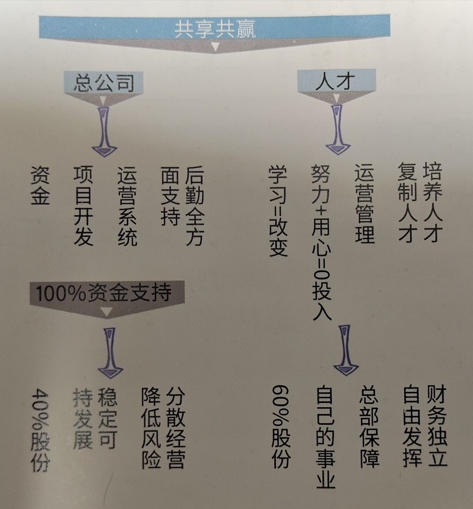

欢迎你能与同创主悦并肩前行！

&emsp;&emsp;每个人都希望有美好的未来与前途。稳定的工作和生活是我们最原始的期待，但日益增长的社会竞争、企业竞争、人才竞争带来的不安又使我们困惑：安稳为王的时代一去不复返，我们是选择与时俱进，还是安于现状？

&emsp;&emsp;现实告诉我们：个人成功的时代已成过去，合作共赢才是未来，而同创主悦的目标就是：你+同创主悦＝美好生活！同创主悦是一条通往美好生活的道路：无论是满足吃穿住行、追求品质生活，还是实现人生意义…每个小伙伴个人梦想的实现，汇聚成同创人的共同梦想，这就是同创梦。同创梦的发展和实现需要每个小伙伴共同努力与参与！

&emsp;&emsp;同创主悦欢迎有理想、有抱负的年轻人，携手努力，共同担当。我们是集团强大的受益者，更是集团壮大的贡献者。在这个平台，你的每一次进步、每一个成长都会有关注与回响！在这个平台，公司与你利益共享、发展共享、股份共享，同心同行，共创共赢!
&emsp;&emsp;愿您快乐！早日达成事业上和生活上的目标！
&emsp;&emsp;让我们一起创造美好的生活！

---
```insta-toc
---
title:
  name:
  level:
  center:
exclude:
style:
  listType:
omit:
levels:
  min:
  max:
---

# 目录

- 企业介绍
    - 集团介绍
    - 领导介绍
- 企业精神
    - 同创梦
    - JUICE
    - 集团口号
    - 愿景
    - 使命
    - 核心价值观
    - 我们能够改变
    - 凡事感激
    - 尽己所能
- 认识企业
    - 我们是谁
    - 我们的不同
        - 同创主悦的机会
        - 其他公司的机会
    - 晋升制度
    - 公司提供什么样的机会
        - 一、工作（你付出劳动和服务赚取收入的平台）
        - 二、免费培训（积累经验、能力提升）
        - 三、改变和塑造人（思维方式、方法、习惯、性格、与人相处……）
        - 四、收入的增加（阶段性的）
        - 五、国内及国外休闲度假
        - 六、白手起家（无须经验、无需投资；从小到大、从无到有）
        - 七、自我掌控
    - 需要什么样的人
    - 公司成功的因素
        - 一、建立产品源头系统
        - 二、建立数据化运营系统
        - 三、建立人才培养体系
        - 四、股份制拓展，共赢共享
    - 为什么要从外出作业开始
        - 一、学会生存的能力
        - 二、自我增值的快速途径
        - 三、获得阶段性的提升和发展
- 销售系统
    - 销售五步
        - 一、打招呼
        - 二、介绍自己
        - 三、介绍产品
        - 四、成交
        - 五、再次成交
    - 成功八点
        - 一、良好的态度
        - 二、准时
        - 三、做好准备
        - 四、做足八小时
        - 五、保持地区
        - 六、保持态度
        - 七、清楚自己做什么、为什么
        - 八、控制场面
    - 平均法
        - 一、做足八小时—充分利用时间
        - 二、保持地区—不挑选地区
        - 三、不挑选客户
        - 四、有质量的沟通—兴奋度和良好的态度
        - 五、HUSTLE—节奏快且有效率
        - 六、见足够多的客户
    - 如何提升销售能力
    - 市场作业行为规范守则
- 企业常识
    - 公司日常运作流程
        - 早上
        - 晚上
    - 一周目标
    - 黄金计划
    - 打钟分享
    - 为什么要拿独立编号
    - 预备主管的晋升条件
    - 家庭日与感恩日
        - 家庭日
        - 感恩日
    - 创悦荟
    - 企业标识
        - 名称
            - 同创主悦
        - LOGO
    - 企业歌
    - 同创杯篮球赛
    - 商学院
        - 愿景
        - 宗旨
        - 人力资源理念
    - 15年目标
    - 誓言
```


# 企业介绍

## 集团介绍

- <span style="background:#40a9ff">由一群80后合伙人主导创建的集团公司</span>
- <span style="background:#40a9ff">集资金、项目、人才为一体的特色链接器</span>
- <span style="background:#40a9ff">经营范围涉及到家用、商业、工业等领域</span>
- <span style="background:#40a9ff">主打满足智能健康生活的消费需求</span>
- <span style="background:#40a9ff">致力于全渠道创新营销</span>
- <span style="background:#40a9ff">业内思维革新多元化发展的范本</span>
- <span style="background:#40a9ff">诸多职业院校进行校企合作的首选</span>
- <span style="background:#40a9ff">大众创业的最佳表达平台</span>
- <span style="background:#40a9ff">国内互联网知名企业的紧密合作伙伴</span>
- <span style="background:#40a9ff">中国最重要的支付工具销售运营通道</span>

## 领导介绍

董事长：<font color="#c0504d">李江涛</font>
总裁：<font color="#c0504d">郭锋</font>
总裁兼财务总监：<font color="#c0504d">蹇泽玲</font>
总裁兼首席市场官（CMO）：<font color="#c0504d">方超</font>
总裁兼首席营运官（COO）：<font color="#c0504d">唐进波</font>
副总裁兼首席行政官(CAO）：<font color="#c0504d">文峰</font>
副总裁兼首席技术官（CTO）：<font color="#c0504d">郭选金</font>

---
# 企业精神

## 同创梦

&emsp;&emsp;<font color="#245bdb">中国梦是中华民族数千年渴望与理想的集合，同创梦是每个同创人对美好生活具体想象的汇聚。</font>

&emsp;&emsp;在这里，更多的人有稳定可发展的工作机会；员工的付出得到非常好的回报，有越来越满意的收入；拥有自己的娱乐中心，员工工作之余精神生活丰富多彩；拥有自己的婚姻服务机构，为员工寻找伴侣牵线搭桥；拥有自己的住宅区，员工享有更舒适的居住条件和更优美的居住环境；拥有自己的学校，让我们的孩子无忧无虑的健康成长；年轻人进入我们的商学院，得到更好的教育；夫妻情侣得到美满的家庭；老人们找到共同的兴趣爱好及伙伴，其乐融融；我们还拥有自己的医院，员工享受高水平的免费的医疗卫生服务；拥有自己的老年康复中心，员工老有所养，安度晚年……这就是同创梦!

## JUICE

- **<span style="background:#40a9ff">让我们一起参与公司发展；</span>**
- **<span style="background:#40a9ff">让我们一起创造兴奋的气氛；</span>**
- **<span style="background:#40a9ff">让我们一起创造企业家；</span>**
- **<span style="background:#40a9ff">让我们一起庆祝发展与成功。</span>**

## 集团口号

&emsp;&emsp;企业口号是企业文化与企业精神的融合，它指导着我们的思想与行为，使我们产生一致的目标，诞生一致的梦想，产生一致的激情。

<font size="6" color="red" >同创同创，共同创造！</font>

<font size ="4" >第一个“同创”，是指同创人；</font>
<font size ="4" >第二个“同创”，是指同创梦；</font>
<font size ="4" >因为有一致的身份定义，才会一起去创造和每个人都相关的美好生活。</font>

## 愿景

<font style = "
font-family : Cursive; 
font-size : 30px;
">中国最佳创业联盟，员工幸福指数最高</font>

## 使命

- 成就顾客
- 成就伙伴
- 成就自己
- 成就家人
- 成就社会

## 核心价值观

- 诚&emsp;&emsp;信—忠诚正直、信守承诺
- 爱人如己—关爱别人像对待自己一样
- 尽己所能—尽心、尽意、尽力、尽性
- 追求卓越—突破自我、不断改变、不断创新、不断成长
- 凡事感激—知恩、感恩、施恩
- 同心同行—群策群力，共享共赢
- 做光做盐—生命影响生命
- JUICE—让我们一起创造美好生活

## 我们能够改变

&emsp;&emsp;我们必须相信，目前我们拥有的，不论顺境逆境，都是对我们最好的安排。若能如此，我们才能在顺境中感恩，在逆境中依旧心存喜悦。
- 人生之事，没有十全十美的
- 心若改变，我的态度跟着改变
- 态度改变，我的习惯跟着改变
- 习惯改变，我的性格跟着改变
- 性格改变，我的人生跟着改变

## 凡事感激

- 感激伤害我的人，因为他磨练了我的心志
- 感激欺骗我的人，因为他增进了我的智慧
- 感激中伤我的人，因为他砥砺了我的人格
- 感激鞭策我的人，因为他激发了我的斗志
- 感激遗弃我的人，因为他教导了我要独立
- 感激绊倒我的人，因为他强化了我的双腿
- 感激斥责我的人，因为他提醒了我的缺点
- 感激所有使我坚强的人

## 尽己所能

- 我不能决定生命的长度，但我可以控制他的宽度
- 我不能左右天气，但我可以改变心情
- 我不能改变容貌，但我可以改变笑容
- 我不能控制他人，但我可以把握自己
- 我不能预知明天，但我可以利用今天
- 我不能样样顺利，但我可以事事尽力

# 认识企业

## 我们是谁

<font size="6">同创主悦</font>
<font size="6">通往美好生活的道路</font>
<font size="6">链接成功与幸福</font>

## 我们的不同

### 同创主悦的机会

- 没有条件限制，人人有机会	
- 短时间内的身份、地位的改变<自己做主>
- 收入丰厚且上升空间不断
- 一生的事业(除非你自己放弃)
- 你能给他人机会
- 无限的扩展舞台	
- 重视人才的培训<有能力培养人>
- 业务-管理-经营
- 支持系统

### 其他公司的机会

- 升迁机会有限，条件限制又多
- 大多是职称的改变<还是受制于别人>
- 收入微薄且上升空间有限
- 不可能长久(随时有非自愿性失业的风险)
- 无法给他人任何机会	
- 局限于眼前而已
- 缺乏培养人的能力，喜欢捡现成<挖角>
- 只会操作职务上的工作	
- 各凭本事

## 晋升制度

&emsp;&emsp;晋升制度，代表着小伙伴们在集团进步与发展的途径和渠道，清晰的晋升制度是小伙伴们制定个人职业生涯规划的重要依据。

<font size="6" color= "red">公开 公正 公平</font>
<font size="4">市场运作</font>
<font size="4">人事培训</font>
<font size="4">团队建设</font>
<font size="4">经营管理</font>

## 公司提供什么样的机会

### 一、工作（你付出劳动和服务赚取收入的平台）

&emsp;&emsp;VS敬老院、福利院、收容所、慈善机构，目前你在公司做什么，你付出劳动和服务赚取收入。

### 二、免费培训（积累经验、能力提升）

&emsp;&emsp;加入公司前你会做销售吗？会带领团队吗？会主持会议吗？会经营公司吗？

不会→→→→会；免费培训，实战操练，能力提升，积累经验。

### 三、改变和塑造人（思维方式、方法、习惯、性格、与人相处……）

&emsp;&emsp;你觉得现在的自己跟加入公司1个月、3个月后的自己，有差别吗？例如：回家朋友、家人会看到你的变化：会说话了、会关心人了、会孝顺长辈了。

### 四、收入的增加（阶段性的）

&emsp;&emsp;你目前收入分几个方向，有几个收入来源呢？<阶段性的>业绩而来+随时都会有活动、奖品+管理奖金+经营利润+后期分红

### 五、国内及国外休闲度假

&emsp;&emsp;玉龙雪山去过吗？天涯海角去过吗？布达拉宫去过吗？长城故宫去过吗？马来西亚、泰国、新加坡、日本、马尔代夫、澳大利亚、埃及、以色列去过吗？

### 六、白手起家（无须经验、无需投资；从小到大、从无到有）

&emsp;&emsp;面试有要求经验吗？让你拿钱了吗？在同创主悦不需要你提供这些，让你获得如：每一位经理都是从一无所有的一个人，到现在有车、有房、有团队、有事业、有话语权、得到认可、获得尊重……

### 七、自我掌控

体现自我价值、被人尊重、帮助更多的人。

## 需要什么样的人
 
1. <font size="5" >尊重公司的人</font>

2. <font size="5">愿意学习和改变的人</font>

3. <font size="5">形象专业、态度谦卑的人</font>

4. <font size="5">有企图心、上进心的人</font>

5. <font size="5">能吃苦耐劳、脚踏实地的人</font>

<font color="#ff0000">学习要加、骄傲要减</font>
<font color="#ff0000">机会要乘、懒惰要除</font>

## 公司成功的因素

### 一、建立产品源头系统

1. 工厂合作（代生产）

2. 品牌商双向持股

3. 厂家直发

4. 掌握产品一手信息源，掌控产品成本

### 二、建立数据化运营系统

1. 品牌推广、市场开发、客服售后于一体、打掉所有中间商

2. 搭建厂家→消费的信息渠道

### 三、建立人才培养体系

1. 企业商学院：自主造血，坚持培养人使用的原则

2. 重视品格意愿、定向培养

3. 多部门轮岗，提升人才综合素质

4. 基层业务→中层管理→高层运营全方向系统培训

5. 建立学习培训班，实效孵化人才

### 四、股份制拓展，共赢共享

&emsp;&emsp;连锁复制的拓展模式。投资人才，共同发展，公司大力实行股份制的拓展方向，让全体伙伴能够在不用自己花钱投资创业的条件下，通过自己的努力、成长、学习和经验的累积，实现晋升、发展、创业的机会，达到真正的财务独立、拥有自己的事业。总部将提供强大后盾支援（HUB、货物、财务、法务、经验、信息……）以达到合作共赢的拓展需求。




## 为什么要从外出作业开始

&emsp;&emsp;外出作业是公司入门学习的一个必要过程，要知道全世界90%以上的企业高管、商业领袖都是经过业务锻炼不断成长的。外出作业是辛苦而又最宝贵的经历，是最快速培养强壮的、最优秀的企业管理人才的快捷方式。

### 一、学会生存的能力

&emsp;&emsp;企业的命运往往跟公司每位成员的命运息息相关，员工能生存，企业才能更好的生存和发展，我们坚信先生存后发展的原则，所以我们更重视企业人才的生存能力；因为只有在企业中真正能够很好的生存的人，才能给企业带来希望和发展，那么外出作业便可以让我们学会掌握个人和企业的生存之道，让我们和企业可以并肩成长。任何行业都是靠发展业务而生存的，外出作业是学习生意管理的开始和起点。

### 二、自我增值的快速途径

&emsp;&emsp;每个伙伴的梦想，当然是希望自己能在企业中找到自己的前途，但前途往往是和个人能力成正比的，否则就只是一纸空谈，外出作业会使你快速成倍提升自己的综合素质，达到实战经验的积累和能力成长的目的。

1. 了解公司的市场运作
2. 心态的磨练（领导者的心态）
3. 能力的锻炼（领导者的能力）

### 三、获得阶段性的提升和发展

1. 业务员：自我管理
2. 组 长：带领、培训新人
3. 部门主管：组建、管理团队
4. 副 理：分公司行政管理
5. 经 理：分公司经营

# 销售系统

## 销售五步

### 一、打招呼

目光、笑容、热忱

### 二、介绍自己

简单、清楚、自信

### 三、介绍产品

将产品放到客人手中、炒价格。

### 四、成交

假设、问题、动作。

### 五、再次成交

创造需求、乘胜追击

## 成功八点

### 一、良好的态度

用最好的态度、饱满的热情与冲动来与人沟通。

### 二、准时

充分运用时间，创造最高效率。

### 三、做好准备

为完成每一个目标，预先筹备资源，计划成功。

### 四、做足八小时

尽心尽力尽意尽性去达成你的目标。

### 五、保持地区

彻底走遍你的地区与每一个顾客沟通，把握每一个机会。

### 六、保持态度

时刻检讨你的态度，每一个“NO”会帮你接近下一个“YES”。

### 七、清楚自己做什么、为什么

知道自己努力的方向及远景，推广产品固然重要，但用产品去学习这门生意就更重要。

### 八、控制场面

察言观色、随机应变、主动出击…

## 平均法

&emsp;&emsp;平均法这一核心概念是根植在这门生意的每一个发展阶段、每一个部门及每一个运作领域中的成功定律，因此学习这一核心概念及如何正确运用是非常重要的。平均法是数学中的机率概念，问的人越多，机会就越大。在销售部门，平均法意味着用兴奋、积极的态度去拜访150至200位以上的客户。争取到最少50至70位以上的客户听完五步，就会得到一个区间的成交率—大约是1/5到1/10的成交机率。平均法是公司系统多年来用实际的市场营销验证出来的定律，是具有可靠性及科学性的。

### 一、做足八小时—充分利用时间

&emsp;&emsp;每天要先做好充分的地区准备，合理的安排及运用地区并规划好运作时间，以期让你每天拜访客户的时间都能获得效益最大化。

### 二、保持地区—不挑选地区

&emsp;&emsp;不论是什么地区，都要用积极乐观的态度去面对--见门就进。充分把握地区中的每一个角落、最大化地增加见人的密度，有助于更快熟悉市场、统筹安排、节约时间、减少盲目性。如此，最能了解自己地区的人和他们所想要的，在同等的地区经营的时间可以更久。

### 三、不挑选客户

&emsp;&emsp;相信任何人都是潜在顾客，不论是什么人，都用热情兴奋的态度去面对，见人就打招呼。充分挖掘市场和顾客潜力的同时，展现个人的能力和风范。

### 四、有质量的沟通—兴奋度和良好的态度

&emsp;&emsp;兴奋的五步才能感染客户，良好的沟通才能有助成交。所以在业务中要保持好轻松、积极、乐观、兴奋的态度与足够多的客户做良好的沟通，才能得到平均法的效益。

### 五、HUSTLE—节奏快且有效率

&emsp;&emsp;外出作业中，走路的速度要快、成交要快，不可磨客户。

### 六、见足够多的客户

&emsp;&emsp;做销售最大的问题就是客户少，抱怨多。没有结果说什么都是无济于事的，倒不如建设性检讨过自己。人数的量变，带来销售的质变。你拜访的客户越多，你成交的客户就越多。当然咱们指的拜访都是用心的拜访，认真去对待的拜访。记住，在外出作业的时候，不让他浪费自己的时间，少聊天，多见顾客。

## 如何提升销售能力

1. 态度---平头哥精神
2. 个人形象
3. 目标---问足够多的人
4. 沟通质量

胆子<font color="#ff0000">大</font>
不怕<font color="#ff0000">事</font>
不服<font color="#ff0000">输</font>

## 市场作业行为规范守则

1. 严格遵守国家法律和行政法规，遵守公司制定的相关规章制度。
2. 应发扬公司企业文化，维护公司形象，树立良好个人形象，自觉维护公司权益和声誉。
3. 在开展业务过程中，需如实详尽向商户介绍我司产品，不得夸大、隐瞒及对商户做不实承诺。
4. 在开展业务过程中，提高法律意识，选择合法合规的优质客户。
5. 不得在开展业务过程中，涉及政治、宗教迷信、不道德、或其他非商业性话题；不得在其他公司兼职。
6. 未经公司允许，不得擅自收取额外费用，不得作出不符合实际情况的口头或书面承诺，不得利用公司的业务关系，推广其他公司的产品和服务。
7. 不得散布未经公司认可的业务、政策、运营等方面的信息，或对公司发布的各类信息作失实的表达或宣传，不得借助任何未经公司授权、不真实、过期、或不再适用的、与推广产品无关、或者导致客户误解的奖状和评语等资讯和凭证。
8. 只可使用公司允许的文字、录音、资料、影像开展业务活动、公司内部的资料，不得转借、发售及赠送给他人。
9. 其他监管机构、国家法律规定的禁止行为。

# 企业常识

## 公司日常运作流程

### 早上

&emsp;&emsp;晨会互动游戏；销售“五步”练习、小组会议；Impact（销售技巧会议）；Meeting(经理分享会议)；工作准备；拍档系统的建立

### 晚上

&emsp;&emsp;组内总结；打钟、打锣、打鼓心得分享；分批培训；Meeting；工作汇总、额外里程

## 一周目标

&emsp;&emsp;所有成功人士都有一个突出特征-目标的确定和有效计划的实施。制定一周目标有助于小伙伴们评估工作的进展，提高工作效率。一周目标，既是激励也是鞭策。

&emsp;&emsp;一周目标应包含核心目标、学习目标、改进目标、执行目标、团队队名队号、实施时间以及实施效果的跟踪。

&emsp;&emsp;如何利用一周目标：
&emsp;&emsp;每周末团队总结时，团队成员应携带个人周目标参与团队会议，汇报个人周目标执行程度与效果，并阐述过程中期望得到的帮助与鼓励；在团队负责人指导下，对下一周的目标进行规划与更新。

## 黄金计划

&emsp;&emsp;早上，有针对性地练习五步，并且做好学以致用的准备。

&emsp;&emsp;重视早晚黄金时间的参与。主动学习，清楚自己的学习方向；以系统为基础，重视个人的成长。

&emsp;&emsp;晚上，总结好的方面；通过数据发现了什么？明天计划和达成措施？

<font size="5">**复杂的事简单做**</font>

<font size="5">**简单的事复杂做**</font>

<font size="5">**重复的事用心做**</font>

## 打钟分享

1. 回到公司第一时间打钟
2. 敲大声一点、时间长一点（敲到接待室和经理办公室门口）
3. 敲钟时要有激情、兴奋，有感染力
4. 上台分享声音洪亮，要有激情和气势
5. 分享前做好准备、内容要积极、正面、简单、明了（让领队检查分享内容）
6. 懂得推广赚钱和作业乐趣
7. 设定次日目标

## 为什么要拿独立编号

1. 新人正式成为同创人的标志
2. 证明新人和公司同进步、共发展的个人意愿
3. 证明新人能够适应市场，有足够的生存能力
4. 证明新人的个人形象符合集团基本形象的标准

## 预备主管的晋升条件

1. 打钟

2. 对企业文化认可

3. 强烈的企图心

4. 专业形象

5. 主动解决问题

6. 关键时刻关键表现

7. 正面思维能力

## 家庭日与感恩日

### 家庭日

&emsp;&emsp;每周三，特别是晚餐时间，团队所有“家庭成员”聚在一起，把酒言欢、侃侃而谈。我们分享个人心得与成长过程；也交流上半周遇到的快乐与失意，更彼此鼓励，互加力量；确定下半年的目标与计划，传递热爱与勇气。

&emsp;&emsp;“juice”一下，“家庭日快乐”！

### 感恩日

&emsp;&emsp;周五的感恩日，不仅仅是提醒我们知恩、感恩、施恩，更是企业文化“凡事感激”的践行日。在市场运作中，我们经历着成长过程中的打击、难堪等负面，但因着感恩我们反而更加坚强。因为见不同的你，开拓了眼界，磨练了心态，丰富了阅历，所有挫折最终都变成成功的垫脚石！

&emsp;&emsp;“juice”一下，“感恩日惜福”！

## 创悦荟

&emsp;&emsp;《创悦荟》是由集团企宣部和商学院共同策划出版，2016年5月创刊。作为同创主悦文化建设和传播的重要工具，是外界了解同创主悦发展动态的媒介，也是集团与分公司之间交流的纽带，更是小伙伴们呈现才艺与创意、展现个人风采、展示成长轨迹的载体。

## 企业标识

### 名称

#### 同创主悦

共同创造一家让上海满意满意的企业，这个名字有3层含义：

1. 顾客就是上帝。是我们市场上的最忠诚的客户。

2. 让自己的价值最大化，是自己可以当家做主。成就自己，也是我们企业的使命之一。愿同创主悦的平台也能成为你美好的个人舞台。

3. 对标准和要求有敬畏的人，总会得到更多，我们共同努力，让命运之神更多施恩！

### LOGO

&emsp;&emsp;意：圆周率\pi是无限小数，在同创主悦的发展无限、你的可能无限！

&emsp;&emsp;形：TC组合而成的\pi，美好生活是靠“共同”“创新”、“共同”“创造”！

&emsp;&emsp;画：四笔分别代表一线小伙伴们、核心骨干、职业经理人、集团创始人，小伙伴们永远是第一位！

&emsp;&emsp;色：海蓝色为主色调，代表同创主悦海纳百川的胸怀；边缘处是天蓝色，代表后续发展是比海宽、如天广的格局。

## 企业歌

&emsp;&emsp;《兄弟 抱一下》作为同创主悦的企业歌，由同创主悦集团出品、顶级团队打造，于2018年1月登陆各大音乐网站。歌词中蕴含着同创主悦的使命与价值观，旋律间流淌着同创人充沛的激情与生命力；唱的是肝胆相照的兄弟情，颂的是生命不息、奋斗不止的拼搏与奋进。

<center>在同创主悦的世界里</center>
<center>你就这样的出现</center>
<center>我回过头</center>
<center>你的笑容就看见</center>
<center>在充满激情的天空下</center>
<center>兄弟顶天又立地</center>
<center>携手并肩</center>
<center>呼风唤雨是兄弟</center>
<center>一杯酒 热血上心头</center>
<center>我们的情谊 高如山 深如海</center>
<center>一杯酒 永生做朋友</center>
<center>我们兄弟情 如烈酒 情长在</center>
<center>（一杯酒 热血上心头
刀山与火海 好兄弟一起走
一杯酒 永生做朋友
心跳多久就做多久）</center>
<center>兄弟抱一下 为岁月的牵挂</center>
<center>兄弟抱一下 未来的路不惧怕</center>
<center>一起抱一下 共同见证中国同创</center>
<center>中国梦 同创梦 牵手创辉煌</center>

## 同创杯篮球赛

&emsp;&emsp;“同创杯”篮球赛是同创主悦企业文化中“运动精神”的融合落地项目。这个属于所有同创人的大型赛事，由副总裁担纲球协主席组织举办，并由来自全国分公司的漂亮小姐姐们自发组成拉拉队助力参与。在丰富小伙伴们业余生活的同时，更为企业中的广大篮球爱好者们，提供了一个面向全国展现个人魅力的舞台。

## 商学院

&emsp;&emsp;同创主悦商学院是直属于集团理事会的专职培育机构，核心功能为：解决企业一切的培训需求；考核、选拔企业所需要的人才；与时俱进地给予新方向、新技能的带领。按照“开放式培训”模式，运用“以人为本”的实效培训手段，商学院旨在通过企业文化的导入与职业素养的培育，形成“打造合格企业人”的智慧平台，最终成为为集团规划与战略目标服务、推动集团快速稳健倍增发展的赋能组织。

### 愿景

让更多人因我们而成就

### 宗旨

严谨 务实 负责 创新 成就

### 人力资源理念

让每个人的价值最大化

形成多效益利益共同体，

共创共赢共享价值。

## 15年目标

&emsp;&emsp;国家有发展计划，企业也有自己的发展蓝图。同创主悦的十五年目标不仅是对集团目标和方向的规划，更是对小伙伴们发展道路与美好前程的筹划。

**同创主悦未来一定会成为百亿、千亿级的企业，帮助更多的人成功，万人成为百万富翁；千人成为千万富翁；百人成为亿万富翁。**

## 誓言

&emsp;&emsp;企业誓言代表着一个企业的整体价值取向，是企业文化的一种体现形式。

&emsp;&emsp;同创主悦的誓言蕴含着同创主悦集团“同心同行、共享共赢”的人才观与价值观，也是集团发展不可缺少、具有纲领性与指引性的灯塔。

**作为同创主悦的联合创始人，不论遇到任何困难和挫折，我们都将倾尽全力把同创主悦做大做强，有福同享，有难共担，绝不退缩，共同完成同创大业！**
